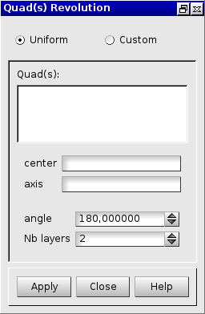
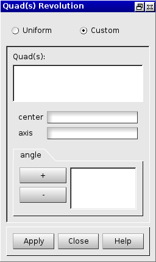

:tocdepth: 3

.. _guiquadsrevolution:

===============
Quad revolution
===============

To make a **Quad revolution** in the **Main Menu** select **Model -> Operation -> Quad Revolution**.

.. _guiquadsrevolutionuniform:

Uniform Quad Revolution
=======================

.. centered::
      Dialog Box to make a uniform quadrangle revolution

**Arguments:** 

- *Quad(s)*  : a set of quadrangles from which hexahedrons will be created (select quads).
- *center*   : center of rotation (select a vertex).
- *axis*     : axis of rotation (select a vector).
- *angle*    : Specify the rotation's angle at each step.
- *Nb layers*: the number of steps.

TUI command: :ref:`tuiquadsrevolutionuniform`

.. _guiquadsrevolutioncustom:

Custom Quad Revolution
======================

.. centered::
      Dialog Box to make a custom quadrangle revolution

**Arguments:** 

- Quad(s): a set of quadrangles from which hexahedrons will be created (select quads).
- center: center of rotation (select a vertex).
- axis: axis of rotation (select a vector).
- angle: a set of angle (in degrees). Specify the rotation's angle at each step.

TUI command: :ref:`tuiquadsrevolutioncustom`

