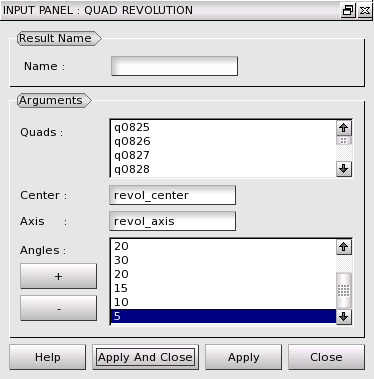
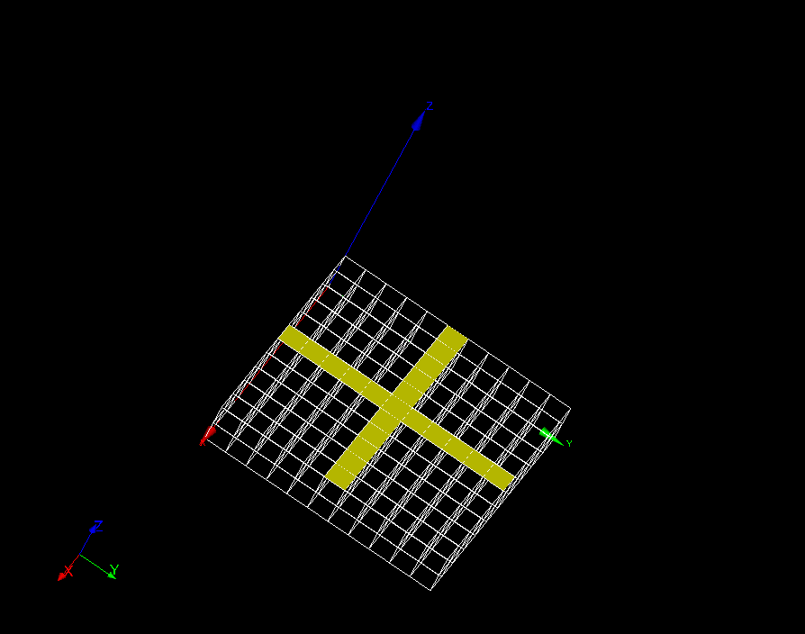
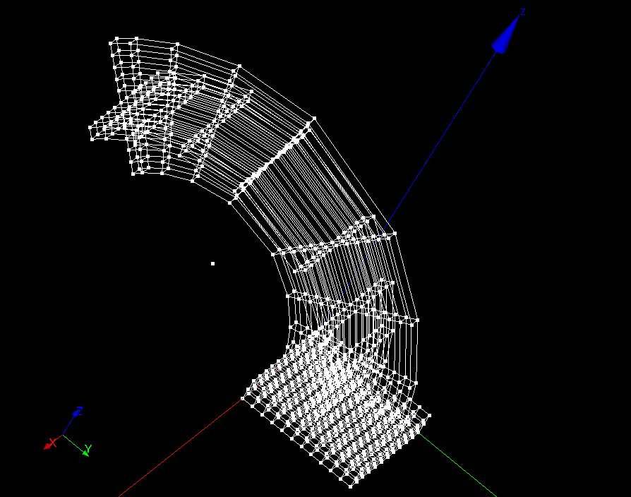

:tocdepth: 3

.. _guiquadrevolution:

===============
Quad revolution
===============

To make a **Quad revolution** in the **Main Menu** select **Model -> Quad Revolution**.

.. centered::
      Dialog Box to make a quadrangle revolution

The following data are required:

- Result Name
    - name: name of the elements created (**optional**).

- Arguments
    - Quads: a set of quadrangles from which hexahedrons will be created (select quads).
    - Center: center of rotation (select a vertex).
    - Axis: axis of rotation (select a vector).
    - Angles: a set of angle (in degrees). Specify the rotation's angle at each step of it.

Here is an example where the selected quadrangles are highlighted:

.. centered::
   Quad selection

The result:

.. centered::
   Quadrangle revolution

TUI command: :ref:`tuiquadrevolution`

