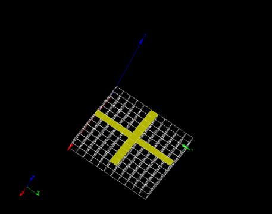
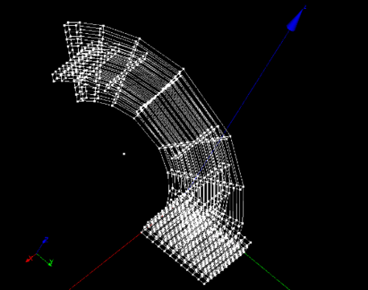

:tocdepth: 3

.. _guiquadrevolution:

==========
Quad revolution
==========

To make a **Quad revolution** in the **Main Menu** select **Model -> Quad Revolution**

.. image:: _static/gui_quadrevolution.png
   :align: center

.. centered::
      Dialog Box to make a quad revolution

The following data are required :

- Result Name
	- name : name of the elements created ( **optionnal** )

- Arguments
        - Quads  : a set of quads from which hexahedrons will be created ( select quads  )
	- Center : center of rotation ( select a vertex )
	- Axis   : axis of rotation ( select a vector )
	- Angles : a set of angle ( in degrees ). Specifie the rotation's angle at each step of it 

Here is an example where the selected quads are highlighted :

.. centered::
   Quad selection

The result :

.. centered::
   Quad revolution

TUI command: :ref:`tuiquadrevolution`

