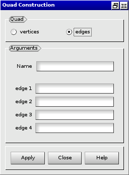

:tocdepth: 3

.. _guiquadrangles:

==========
Quadrangle
==========

To create a **Quadrangle** in the **Main Menu** select **Model -> Construction -> Add Quadrangle**.

There are two algorithms to create a **Quadrangle**.

Create from vertices
====================
The **Quadrangle** can be defined by its vertices **Vertex 1**, **Vertex 2**,
**Vertex 3** and **Vertex 4**.

**Arguments:** 4 vertices.

The dialogue box for to create a quadrangle from vertices is:

.. image:: _static/gui_quad_vertices.png
   :align: center

.. centered::
   Add Quadrangle from vertices

Create from edges
=================
The **Quadrangle** can also be defined by its edges **Edge 1**,
**Edge 2**, **Edge 3** and **Edge 4**.

**Arguments:** 4 edges.

The dialogue box to create a quadrangle from edges is:

.. centered::
   Add Quadrangle from edges

TUI command: :ref:`tuiquadrangles`
