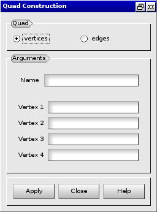

:tocdepth: 3

.. _guiquadrangles:

==========
Quadrangle
==========

To create a **Quadrangle** in the **Main Menu** select **Model -> Add quad** 

There are 2 algorithms to create a **Quadrangle**.

Firstly you can define a **Quadrangle** through **Vertex 1**, **Vertex
2**, **Vertex 3** and **Vertex 4**, which ares the points through wich the **Quadrangle** passes.

**Arguments:** 4 vertices

The dialogue box for the creation of a quadrangle from vertices is:

.. centered::
   Add Quadrangle from vertices

Secondly you can define a **Quadrangle** through **Edge 1**, **Edge
2**, **Edge 3** and **Edge 4**.

**Arguments:** 4 edges

The dialogue box for the creation of a quadrangle from edges is:

.. image:: _static/gui_quad_edges.png
   :align: center

.. centered::
   Add Quadrangle from edges

TUI command: :ref:`tuiquadrangles`
