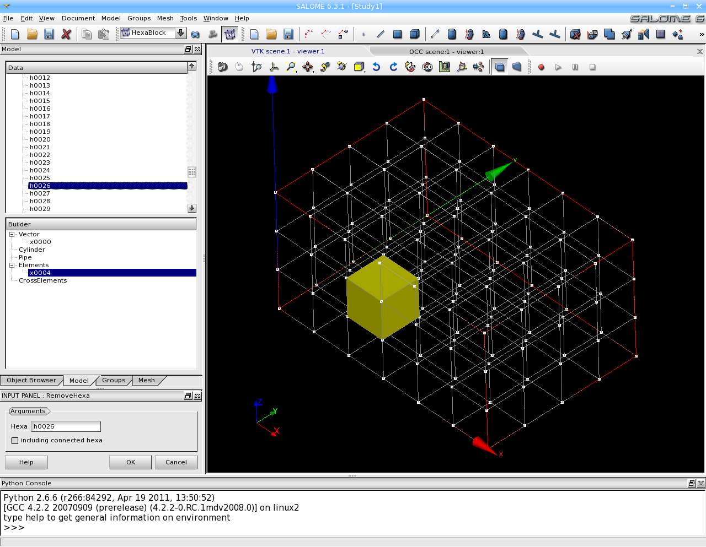
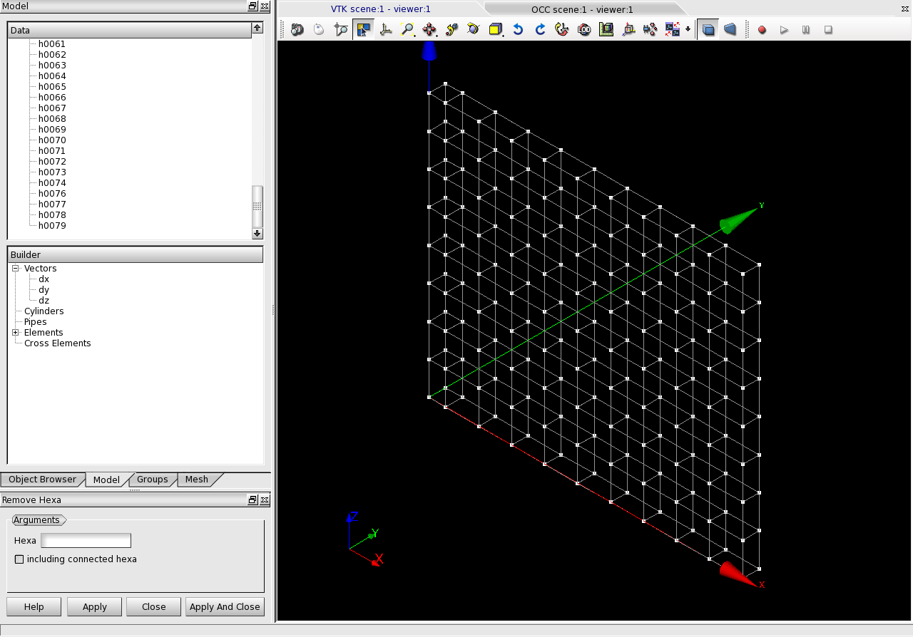

:tocdepth: 3

.. _guiremove:

================
Remove hexahedra
================

To remove an **Hexahedron** in the **Main Menu** select **Model -> Operation -> Remove hexahedra**.

**Arguments:** 1 hexahedron and a flag to indicate if connected hexahedra should be removed or not.

The dialogue box for removing hexahedra:

.. centered::
   Remove hexahedra

The selection can be made either in the list of hexahedra or in the graphic zone.

The result of this action is:

TUI command: :ref:`tuiremove`
