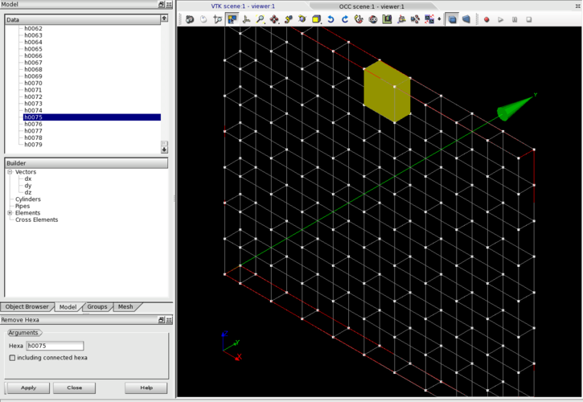

:tocdepth: 3

.. _guiremove:

================
Remove hexahedra
================

To remove an **Hexaedron** in the **Main Menu** select **Model -> Remove hexa** 

**Arguments:** 1 hexaedra + select if including connected hexa or not

The dialogue box for removing hexahedra:

.. centered::
   Remove hexahedra

The selection can be made either in the list of hexahedra or in the graphic zone.

The result of this action is:

.. image:: _static/remove3.png
   :align: center

TUI command: :ref:`tuiremove`
