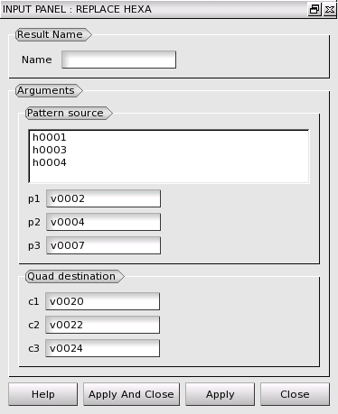
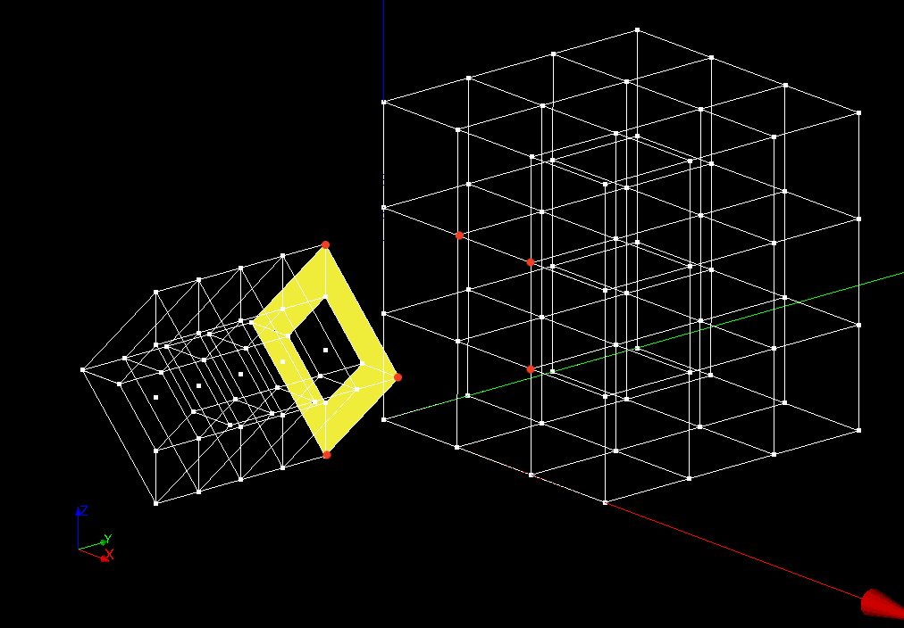
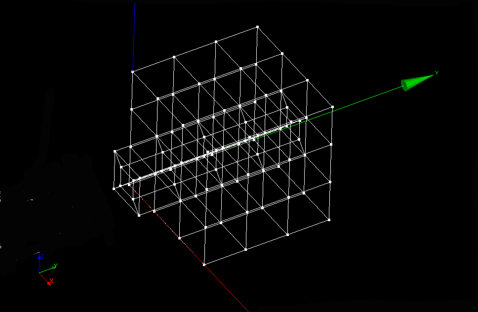

:tocdepth: 3

.. _guireplacehexa:

==================
Replace hexahedron
==================

To **Replace an hexahedron** in the **Main Menu** select **Model -> Operation -> Replace Hexahedron**.

.. centered::
      Replace Hexahedron Dialog Box

The following data are required:

- Quad(s) source
    - Quad's source: the set of quads to be extruded (select quads).
    - s1, s2, s3: vertices from the set of quads. (select vertices).

- Quad destination
    - d1, d2, d3: vertices which define the target quad.
      As a result of the operation, each one are replaced: s1->d1, s2->d2, s3->d3 (select vertices).

Here is an example where the source quadrangles and vertices are highlighted:

.. centered::
   Source selection

The result is:

.. centered::
   Hexa replaced

TUI command: :ref:`tuireplacehexa`

