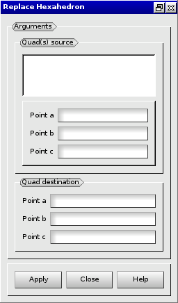

:tocdepth: 3

.. _guireplacehexa:

==========
Replace hexa
==========

To **Replace hexa** in the **Main Menu** select **Model -> Replace Hexa**

.. centered::
      Replace Hexa Dialog Box

The following data are required:

- Result Name
	- name  : name of the elements created ( **optionnal** )

- Quad(s) source
        - Quad's source : the set of quads to be extruded ( select quads )
	- s1, s2, s3 : vertices from the set of quads. ( select vertices )

- Quad destination
        - d1, d2, d3 : vertices which define the target quad. As a result of the operation, each one are replaced : s1->d1, s2->d2, s3->d3  ( select vertices )

Here is an example where the quads and vertices source are highlighted:

.. centered::
   Source selection

The result is:

.. image:: _static/replacehexa.png
   :align: center

.. centered::
   Hexa replaced

TUI command: :ref:`tuireplacehexa`

