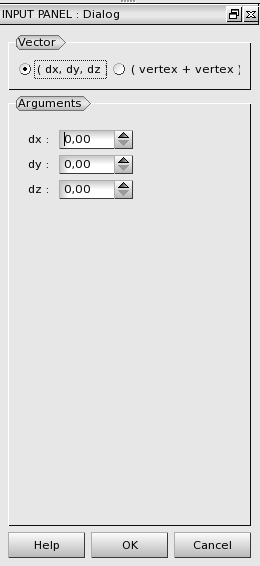
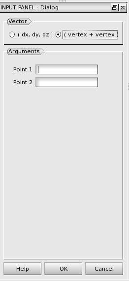

:tocdepth: 3

.. _guivector:

======
Vector
======

To create a **Vector** in the **Main Menu** select **Model -> Construction -> Add vector**.

There is no construction of blocks.
Vector is an intermediate object built in order to make the dialog boxes of blocks construction more concise.

There are two methods to create a **Vector**.

Create with dx, dy, dz
======================
The **Vector** can be defined by **dx**, **dy** and **dz**.

**Arguments:** 3 reals.

The dialogue box to create a vector with dx, dy, dz is:

.. centered::
   Add Vector

Create with two vertices
========================
The **Vector** can also be defined by two vertices **Point1** and **Point2**.

**Arguments:** 2 vertices.

The dialogue box to create a vector from two vertices is:

.. centered::
   Add Vector from 2 Vertices

TUI command: :ref:`tuivector`
