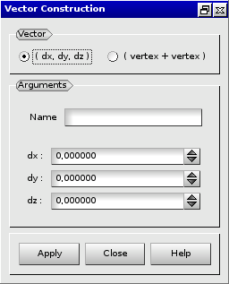
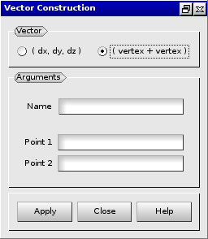

:tocdepth: 3

.. _guivector:

======
Vector
======

To create a **Vector** in the **Main Menu** select **Model -> Add vector** 

There are 2 algorithms to create a **Vector**.

Firstly you can define a **Vector** through **dx**, **dy** and **dz**.

**Arguments:** 3 reals.

The dialogue box for the creation of a vector is:

.. centered::
   Add Vector

Secondly you can define a **Vector** through **Point1** and **Point2**.

**Arguments:** 2 vertices.

The dialogue box for the creation of a vector from 2 vertices is:

.. centered::
   Add Vector from 2 Vertices

TUI command: :ref:`tuivector`
