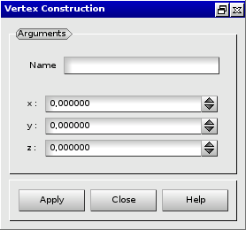

:tocdepth: 3

.. _guivertex:

========
Vertex
========

To create a **Vertex** in the **Main Menu** select **Model -> Construction -> Add vertex**.

The vertex is defined by settings its x, y and z **Coordinates**.

**Arguments:** x, y and z coordinates of the vertex.

The dialogue box for the creation of a vertex is:

.. centered::
   Add Vertex

TUI command: :ref:`tuivertex`
