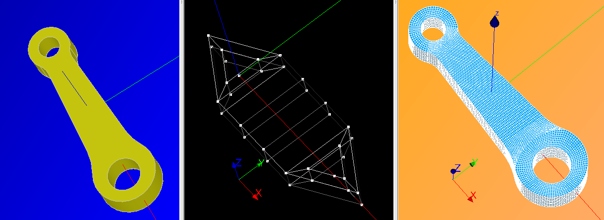

%%%%%%%%%%%%%%%%%%%%%%%%%
HEXABLOCK's documentation
%%%%%%%%%%%%%%%%%%%%%%%%%

.. centered::
   Geometry - Model of blocks - Hexahedral mesh

Contents:

.. toctree::
   :maxdepth: 2

   general.rst
   interactive.rst
   python.rst

Indices and tables
==================

* :ref:`genindex`
* :ref:`modindex`
* :ref:`search`
