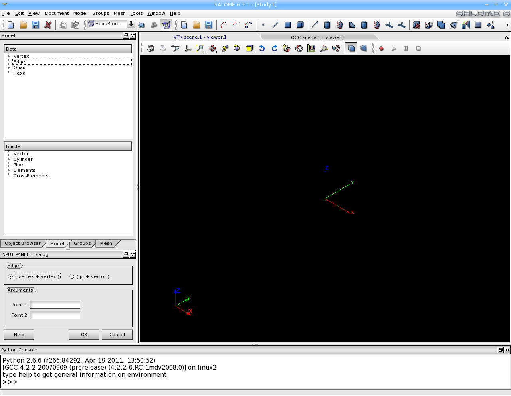

:tocdepth: 3

.. _interactive:

#######################################################
Using HexaBlock with the Graphical User Interface (GUI)
#######################################################

HexaBlock is a component of SALOME with an interactive part and has:

- its own menus and toolboxes,
- its document zone to represent all kind of objects (vertices, hexahedral, etc.),
- its graphic zone to visualize the model and the mesh.

It provides the toolset allowing to:

- Build a model of block:
   - create basic geometrical objects: point, edge, quadrangle, hexahedra,
   - create grid: cartesian, cylindrical, spherical,
   - create  a cylinder, a pipe, two intersected cylinders, two intersected pipes, an hemisphere, a rind,
   - remove an hexahedron,
   - replace hexahedrons,
   - disconnect by a point, an edge, a quadrangle,
   - join quadrangles by hexahedra, merge quadrangles,
   - transform or modify by translation, rotation and other symmetries,
   - make quad revolution.
- Associate a model of block to a geometry:
   - associate vertices of the model of blocks to vertices of a geometry,
   - associate edges of the model of blocks to edges of a geometry,
   - associate quadrangles of the model of blocks to faces of a geometry,
   - associate lines.
- Generate a mesh:
   - define groups,
   - define laws on propagations,
   - generate an hexahedral mesh.

.. toctree::
   :maxdepth: 2

   gui_component.rst
   gui_document.rst
   gui_vertex.rst
   gui_edge.rst
   gui_quadrangle.rst
   gui_hexahedron.rst
   gui_vector.rst
   gui_blocks_for_cyl_pipe.rst
   creategrids.rst
   gui_hemisphere.rst
   gui_remove.rst
   gui_cut_hexa.rst
   gui_prism_join_quad.rst
   gui_quad_revolution.rst
   gui_replace_hexa.rst
   gui_merge_elmts.rst
   gui_disc_elmts.rst
   gui_make_elmts.rst
   gui_make_symmetry.rst
   gui_modify_elmts.rst
   gui_modify_symmetry.rst
   gui_association.rst
   gui_add_geometry.rst
   gui_asso_quad_to_geom.rst
   gui_asso_vertex_to_geom.rst
   gui_groups.rst
   gui_discret_law.rst
   gui_propag.rst
   gui_mesh.rst
