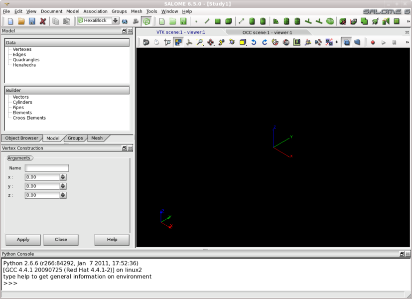

:tocdepth: 3

.. _interactive:

#######################################################
Using Hexablock with the Graphical User Interface (GUI)
#######################################################

This application is a component of SALOME (like SMESH) and has:

- its own menus and toolboxes
- its document zone to represent the coordinates
- its graphic zone to visualize the model and the mesh.

It provides the toolset allowing to create a large range of geometrical objects and functionnalities:

- create basic geometrical objects: point, edge, quadrangle, hexahedra
- create grid: cartesian, cylindrical, spherical
- create  a cylinder, a pipe, two intersected cylinders, two intersected pipes
- remove an hexahedron
- disconnect by a point, an edge, a quadrangle
- join quadrangles by hexahedra, merge quadrangles
- transform or modify by translation, rotation and other symetries

.. toctree::
   :maxdepth: 2

   gui_component.rst
   gui_document.rst
   gui_vertex.rst
   gui_edge.rst
   gui_quadrangle.rst
   gui_hexahedron.rst
   gui_vector.rst
   gui_cyl.rst
   gui_pipe.rst
   gui_remove.rst
   creategrids.rst
   gui_blocks_for_cyl_pipe.rst
   gui_prism_join_quad.rst
   gui_merge_elmts.rst
   gui_disc_elmts.rst
   gui_cut_hexa.rst
   gui_make_elmts.rst
   gui_make_symmetry.rst
   gui_modify_elmts.rst
   gui_modify_symmetry.rst
   gui_asso_quad_to_geom.rst
   gui_groups.rst
   gui_discret_law.rst
   gui_propag.rst
   gui_mesh.rst
   

