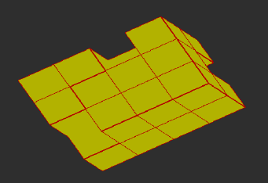

:tocdepth: 3

.. _interactive:

######################
Interactive part
######################

Introduction
============
This application is a Corba component of SALOME (like SMESH) et has:

- its own menus and toolboxes
- its document zone to represent the coordinates
- its graphic zone to visualize the model and the mesh.

It provides the toolset allowing to create a large range of geometrical objects and functionnalities :

- create basic geometrical objects: point, edge, quadrangle, hexahedra
- create grid: cartesian, cylindrical, spherical
- create  a cylinder, a pipe, two intersected cylinders, two intersected pipes
- remove an hexahedron
- disconnect by a point, an edge, a quadrangle
- join quadrangles by hexahedra, merge quadrangles
- transform or modify by translation, rotation and other symetries

Create an hexahedron
====================

The dialogue box for the creation of an hexahedron is:

.. image:: _static/dialogbox.PNG
   :align: center

.. centered::
   Create an Hexahedron

Create grids
====================

.. _cartgrid:

Cartesian grid
----------------

To create a cartesian grid, the follwing data are required:

- the vertex (corner) of the initial hexahedron
- the vertex which is diametrically opposite to the initial vertex 
	- vector determining the vertex of the next hexahedron along the three axes X, Y, Z
	- three vectors determining the vertex of the next hexahedron
- the number of repetition of this hexahedron along the three axes in the positive direction
- the number of repetition of this hexahedron along the three axes in the negtive direction

The dialogue box for the creation of a cartesian grid is:

.. image:: _static/dialogbox_cartgrid.PNG
   :align: center

.. centered::
   Cartesian grid

The result of this action is:

.. image:: _static/cartgrid1.PNG
   :align: center

.. centered::
   Result Cartesian Grid

.. _cylgrid:

Cylindrical grid
----------------

To create a cylindrical grid, the follwing data are required:

- the coordinates of the cylinder base center 
- the vector defining the axe and the direction of the cylinder
- the radial size, the anguler size and axial size
- choose to fill or not the central part of the hexahedra

Example:

.. image:: _static/dialogbox_cylgrid.PNG
   :align: center

.. centered::
   Dialogue Box for a Cylindrical grid

The result:

.. image:: _static/db_cylgrid.PNG
   :align: center

.. centered::
   Cylindrical grid

.. _sphgrid:

Spherical grid
----------------

To create a spherical grid, the follwing data are required:

- the center coordinates of the central hexaheddron
- the sizes along the X, Y, Z axes of this hexahedron
- the number of embeded hexahedra

Example:

.. image:: _static/db_sph_grid.PNG
   :align: center

.. centered::
   Dialogue Box for a Spherical grid

The result of this action is:

.. image:: _static/sph_grid.PNG
   :align: center

.. centered::
   Resulting Spherical grid

Remove hexahedra
=================

The dialogue box for removing hexahedra:

.. image:: _static/dialogbox_remove.PNG
   :align: center

.. centered::
   Remove hexahedra

The selection can be made either in the list of hexahedra or in the graphic zone.

Define groups on the model
=============================

A group is characterized by:
- its type
- its name
- its elements

.. image:: _static/dialogbox2.PNG
   :align: center

.. centered::
   legend

Define a discretization law
==================================

A discretization law is defined by four properties:

- the name of the law
- the number of nodes for the discretization law
- the kind of the law 
	- uniform
	- arithmetic
	- geometric
- the coefficient for the arithmetic and geometric law

The dialogue box for creating, editing and removing a set of laws is:

.. image:: _static/dialogbox_law.PNG
   :align: center

.. centered::
   law

To modify a law, select a box and change the value. To add a new law, select the pseudo-law <new> to give it a name and click on the boxes corresponding to these attributes to allocate different values. To suppress a law (except the default law), leave the law name blank.

Discretize on the propagation edges
=====================================

.. image:: _static/dialogbox_discreti.PNG
   :align: center

.. centered::
   dicretization

