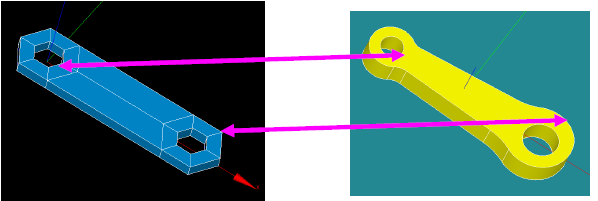

:tocdepth: 3

.. _assomodelgeo:

================================================
Associate this model of blocks with the geometry
================================================

Associate the model to the geometry means that the geometry to mesh is
"raw" for this application. In other words, there will be no
modification of this geometry end no rebuild of a complete new
geometry. However it is possible to complete this geometry by adding
new pieces if necessary without any topological operation to link
these pieces to the initial geometry. Generally, the geometry to mesh
is defined as a set of faces, if these faces are not given under solid
form but form logically this solid, it is sufficient for this
application.

To associate the model to the geometry, three successive steps are to be followed:

1. Mandatory: associate **all the vertices** of the model to the geometry
2. If necessary: associate **the needed edges** of the model to the geometry
3. If necessary: associate **the needed faces** of the model to the geometry

The HexaBlock application enables to follow these three steps
independently (see :ref:`assoelemts`). To facilitate the association
of the model to the geometry, an alternative way exists: the first two
steps above can be replaced by a new stage called association by lines
(see :ref:`assolines`).

.. centered::
   Rod connecting

.. _assoelemts:

Elements association
====================

Associate the vertices 
----------------------

This step is essential, all the vertices of the model must be associated to the geometry.

There are 4 ways for this association:

- associate one vertex "v" of the model to a "vertex" of the shape "s"
  of the geometry.

- associate one vertex "v" of the model to a point of curvilinear
  abscissa "p" of the "edge" included in the shape "s" of the
  geometry.

- associate one vertex "v" of the model to a point of coordinates
  "u,v" of the "face" included in the shape "s" of the geometry.

- associate one vertex "v" of the model to a any point.

It is possible to examine the association (vertex of the association
model, x-y-z-coordinates of the point of the association geometry).

For each vertex, the association is made in three steps:

- Choose a vertex of the model to associate.
- Choose the way of associating among the 4 possibilities described above.
- Specify the point on the geometry, the process depends on the previous choice:
    - case of an existing vertex: selection and highlight on the
      vertices of the geometry solely
    - case of a point taken on an edge of the geometry: selection
      and highlight of the edges and of a point on the edge in the
      process of being selected.
    - case of a point taken on an face of the geometry: selection
      and highlight of the faces and of a point on the face in the
      process of being selected.
    - case of a new point: ask the coordinates and visualize this
      new point.

.. _assoedges:

Associate the edges 
-------------------

This step is optional. An association of every edge is determined
automatically before generating the mesh. This automatic process
applies four different algorithms in the following order:

- the first algorithm determines a wire between the two vertices by
  taking the shortest way.
- if that wire does not exist, then another wire is build in the following manner:
    - compute the normals to the two vertices,
    - compute the mean normal of the two previous normals,
    - build the plan passing through the two vertices and this
      mean normal,
    - the sought-after wire is the intersection of the geometry
      with the plan,
- if the intersection with this plan fails, then another wire
  "iso-type" is determined between the two vertices and going along
  the faces of the geometry linking these two vertices,
- if this wire still does not exist, then the vertices are linked by a
  line segment.

If one of the automatic choices is not appropriate, then the
association of the edge of the model to the geometry has to be defined
explicitly.

Associate the quadrangles 
-------------------------

This step is optional. The model quadrangles association is
automatic. The three cases are processed:

- all the geometric faces exist then the nodes are computed on these faces,
- the faces do exist but some pieces are missing because of the new edges or vertices, in that case two strategies are deployed:
    - automatic construction of the missing faces from the contour lines,
    - or association of new faces build in the geometry,
- there are no associated faces to the quadrangle of the model:
    - only the automatic mesh is used,
    - if this automatic mesh does not work, then it is possible to
      associate to the model quadrangle a geometric face build in
      GEOM by the user.

If one of the automatic choices is not appropriate, then the
association of the quadrangle of the model to the geometry has to be
defined explicitly.

.. _assolines:

Association by lines
====================

The description of this step is:

- At the end of this new stage, it is necessary that all points of the
  model blocks are associated with the vertices of the geometry,
- The process is to associate the lines of the model of blocks to
  vertices and edges of geometry until all points of the model of blocks
  are associated,
- When all points of the model of blocks are associated, it is still
  possible to complete with step 2 above (see :ref:`assoedges`) to
  finish the association of needed edges.

See TUI  scripts and GUI part.
