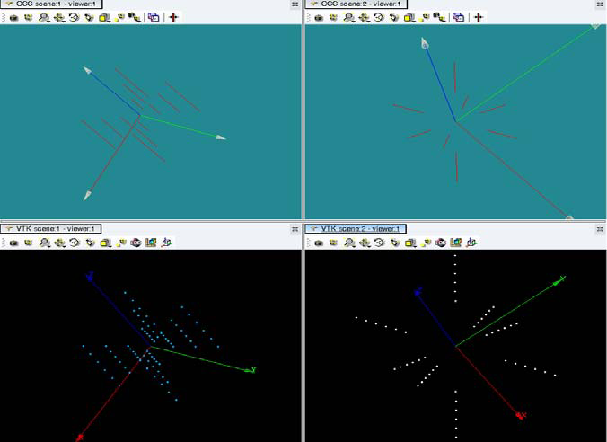
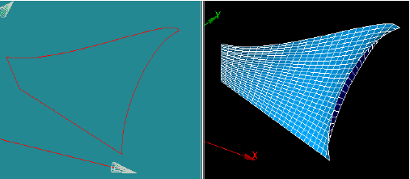
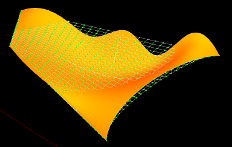
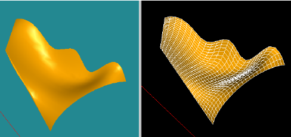

:tocdepth: 3

.. _mesh:

============================
Generate the hexahedral mesh
============================

The main stages to mesh with HexaBlock are:

- Define all discretization laws, a law is characterized by:

    - A number of nodes
    - A distribution (uniform, arithmetic, etc.)

- Apply a law on a set of edges

    - This set of edges has the propagation property
    - This set is defined directly on the model of blocks

- Define all groups directly on the model of blocks:

    - Groups of nodes
    - Groups of segments, of quadrangles, of hexahedra

- Parametrization of the mesh generation

Define a law of discretization
==============================

A discretization law is defined by four properties:

- the name of the law
- the number of nodes for the discretization law
- the kind of the law 
    - uniform
    - arithmetic
    - geometric
- the coefficient for the arithmetic and geometric law.

Set the propagation laws
========================

From the model, an edges partition is determined, each part
characterizes a propagation set. To each propagation is associated a
discretization law and an application way to this law. By default, the
law "Default" is applied on every propagation. It is possible to use
the same law for different propagations.

.. _generatemesh:

Generate the mesh
=================

Once the model and its association to the geometry created, the
hexahedral mesh can be generated by mentioning:

- the discretization of the edges thanks to discretization laws
- the potential groups

To discretize, the application proceeds in three steps:

- the application computes a partition of the model edges, where each sub-set of edges corresponds to the edges related to the propagation,

- the user defines the needed discretization laws, a law is characterized by:

    * the name of this law,
    * the number of nodes to compute
    * a distribution (uniform, arithmetic, etc.)

- the user (working on the model) apply a discretization law on each sub-set of propagation edges

The groups are defined on the model of blocks and the main types of groups are:

- groups of hexahedra
- groups of quadrangles
- groups of edges
- groups of nodes

.. centered::
   Example of propagation-linked edges sub-set 

Mesh Algorithm
===============

Node generation process follows four steps:

1. generate all the nodes corresponding to the vertices of the model
2. generate all the nodes corresponding to the edges of the model
3. generate all the nodes corresponding to the faces of the model
4. generate all the nodes corresponding to the blocks of the model

The nodes generated by the meshing of the edges are determined by the
discretization law associate to this edge. The coordinates of these
nodes are computed on the geometric edges series associate to this
edge. To do so/ a curvilinear abscissa is calculated and based on
total length of the 1D geometry associate. The geometric modeler (GEOM
of SALOME or CasCade) enables to compute this length.

The nodes that are generated by meshing of faces are computed in two stages:
1. meshing by linear approximation
2. refining by projection on the geometry if this geometry exists.

The meshing by linear approximation performs the three following calculations:

- computation of node coordinates according to the *i* direction taking into account the discretization law on the *j* direction
- computation of node coordinates according to the *j* direction taking into account the discretization law on the *i* direction
- the node coordinates are the coordinates of the midpoint of the segment that is formed from the two previous points
- if there is a projection step, then the normal at this node is computed 

The computation of the normal at a node (i,j) is performed thanks to the neighbor nodes:

- computation of the plan passing through this node and orthogonal to the straight line connecting the nodes (i-1,j) and (i,j+1)
- computation of the plan passing through this node and orthogonal to the straight line connecting the nodes (i-1,j) and (i,j+1)
- the normal passing through the intersection of the two previous plans

If the node belongs to a border, the node itself is taken to build the
line determining the plan which is perpendicular to it.

If there is a geometric face (or a list of faces) associate to one
face of the model, then an additional projection step (taking into
account the normal to the node of the previous step) is computed in
order to obtain a node on the geometric face. The coordinates of this
node are computed using the intersection of the normal with this face
(or this list of faces).

The nodes generated by the meshing of blocks are determined by the
algorithm << i, j, k >> included in the SMESH module of SALOME.

Examples
========

Linear approximation of the discretization of faces
'''''''''''''''''''''''''''''''''''''''''''''''''''''

Geometric face and meshing by approximation
''''''''''''''''''''''''''''''''''''''''''''

Geometric face and meshing by approximation and projection
''''''''''''''''''''''''''''''''''''''''''''''''''''''''''''

 
