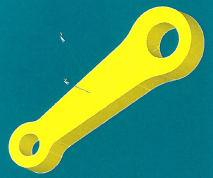

:tocdepth: 3

.. _intropython:

===========================================
Example: Python script for a connecting rod
===========================================

.. centered::
   Connecting rod 

.. _menu:

Steps
=====
    - :ref:`modelcreation`
    - :ref:`recover`
    - :ref:`assoc`
    - :ref:`groupdef`
    - :ref:`lawdisc`
    - :ref:`meshgener`

.. _modelcreation:

Model creation
==============

::

     import math

     import geompy
     import hexablock

     doc = hexablock.addDocument("bielle")

     # ------------------------------------- Build 2 cylindrical grids

     centre_pb = doc.addVertex(0, 0, 0)
     centre_gb = doc.addVertex(7, 0, 0)

     angle_px   = math.pi / 3
     vecteur_px = doc.addVector(math.cos(angle_px), math.sin(angle_px), 0)
     vecteur_gx = doc.addVector(1, 0, 0)

     vecteur_z = doc.addVector(0, 0, 1)

     grille_p = doc.makeCylindrical(centre_pb, vecteur_px, vecteur_z,  1, 360, 1,  1, 3, 1,  False)
     grille_g = doc.makeCylindrical(centre_gb, vecteur_gx, vecteur_z,  1, 360, 1,  1, 3, 1,  False)

     # ------------------------------------- Join the grids

     quad_p = grille_p.getQuadJK(1, 2, 0)
     quad_g = grille_g.getQuadJK(1, 1, 0)
     
     point_p1 = grille_p.getVertexIJK(1, 0, 0)
     point_p2 = grille_p.getVertexIJK(1, 2, 0)

     point_g1 = grille_g.getVertexIJK(1, 1, 0)
     point_g2 = grille_g.getVertexIJK(1, 2, 0)

     prisme = doc.joinQuad(quad_p, quad_g,  point_p1, point_g1,  
                                       point_p2, point_g2,  3)

Go back to :ref:`menu`

.. _recover:

Recovering edges and faces from geometry before the association
===============================================================

::

     bielle = geompy.ImportSTEP("bielle.stp")

     sommets = geompy.SubShapeAllSortedCentres(bielle, geompy.ShapeType["VERTEX"])

     sommets_petit = [  6,  8,  7,  9 ]
     sommets_grand = [ 10, 12, 11, 13 ]

     aretes = geompy.SubShapeAllSortedCentres(bielle, geompy.ShapeType["EDGE"])

     aretes_petit = [  7,  9,  8, 10 ]
     aretes_grand = [ 19, 21, 20, 22 ]

     ga_pbcd = aretes[ 0]
     ga_pbe  = aretes[ 2]

     ga_phcd = aretes[ 1]
     ga_phe  = aretes[ 3]
     
     ga_gbcd = aretes[27]
     ga_gbe  = aretes[25]

     ga_ghcd = aretes[28]
     ga_ghe  = aretes[26]

Go back to :ref:`menu`

.. _assoc:

Association of the model to the geometry
========================================

::

     doc.setShape(bielle)

     # ---------------------------- Clean implicit associations of the model 

     doc.clearAssociation()

     # -------------------------- Procedure who associates external circles 
     def cercle(grille, k, ge, p):
         ms  = grille.getVertexIJK(0, 0, k)

         ma1 = grille.getEdgeJ(0, 2, k)
         ma2 = grille.getEdgeJ(0, 1, k)
         ma3 = grille.getEdgeJ(0, 0, k)

         doc.associateClosedLine(ms, ma1, [ ma2, ma3 ], ge, p, False, [])

     cercle(grille_p, 0, ga_pbe, 5.0/6)
     cercle(grille_p, 1, ga_phe, 5.0/6)
     
     cercle(grille_g, 0, ga_gbe, 0)
     cercle(grille_g, 1, ga_ghe, 0)

     # ------------------- Procedure who associates external decentered lines 
     def arc(grille, i1, i2, k, ge):
         ma1 = grille.getEdgeJ(1, i1, k)
         ma2 = grille.getEdgeJ(1, i2, k)
     
         doc.associateOpenedLine(ma1, [ ma2 ], ge, 0, [], 1)

     arc(grille_p, 1, 0, 0, ga_pbcd)
     arc(grille_p, 1, 0, 1, ga_phcd)

     arc(grille_g, 0, 2, 0, ga_gbcd)
     arc(grille_g, 0, 2, 1, ga_ghcd)

     # ---------------------- Associate archs vertices with connection circles

     hm = prisme.getHexa(1)
     for i in xrange(0, 4):
       vm = hm.getVertex(i)
       ga = sommets[ sommets_petit[i] ]
       vm.setAssociation(ga)

     hm = prisme.getHexa(2)
     for i in xrange(0, 4):
       vm = hm.getVertex(i)
       ga = sommets[ sommets_grand[i] ]
       vm.setAssociation(ga)

     # ---------------------- Associate connection circles

     hm = prisme.getHexa(0)
     for i in xrange(0, 4):
       em = hm.getEdge(i+8)
       ga = aretes[ aretes_petit[i] ]
       em.addAssociation(ga, 0, 1)

     hm = prisme.getHexa(2)
     for i in xrange(0, 4):
       em = hm.getEdge(i+8)
       ga = aretes[ aretes_grand[i] ]
       em.addAssociation(ga, 0, 1)

     # --------------------- Round implicit cylindrical associations

     for h, i, ech in [ [0, 0, 0.95], [0, 1, 0.95],  [2, 2, 0.85], [2, 3, 0.85] ]:
       hm = prisme.getHexa(h)
       em = hm.getEdge(i)
       va = em.getVertex(0).getAssociation()
       vb = em.getVertex(1).getAssociation()
       vax, vay, vaz = geompy.PointCoordinates(va)
       vbx, vby, vbz = geompy.PointCoordinates(vb)
       vmx = ( vax + vbx ) / 2.0 * ech
       vmy = ( vay + vby ) / 2.0
       vmz = ( vaz + vbz ) / 2.0
       vm = geompy.MakeVertex(vmx, vmy, vmz)
       eg = geompy.MakeArc(va, vm, vb)
       em.clearAssociation()
       em.addAssociation(eg, 0, 1)

Go back to :ref:`menu`
 
.. _groupdef:

Definition of elements groups for the mesh
==========================================

::

     # -------------------------- # Define 5 faces groups

     groupe_petit   = doc.addQuadGroup("Petit")
     groupe_grand   = doc.addQuadGroup("Grand")
     groupe_bas     = doc.addQuadGroup("Bas")
     groupe_haut    = doc.addQuadGroup("Haut")
     groupe_contour = doc.addQuadGroup("Contour")

     # -------------------------- Define little and big cylinder groups

     for i in xrange(3):
       groupe_petit.addElement( grille_p.getQuadJK(0, i, 0) )
       groupe_grand.addElement( grille_g.getQuadJK(0, i, 0) )

     # -------------------------- Define bottum and up groups

     for i in xrange(3):
       groupe_bas.addElement(  grille_p.getQuadIJ(0, i, 0) )
       groupe_bas.addElement(  grille_g.getQuadIJ(0, i, 0) )

       groupe_haut.addElement( grille_p.getQuadIJ(0, i, 1) )
       groupe_haut.addElement( grille_g.getQuadIJ(0, i, 1) )

     for i in xrange(3):
       h = prisme.getHexa(i)

       groupe_bas.addElement(  h.getQuad(2) )
       groupe_haut.addElement( h.getQuad(3) )

     # -------------------------- Define border group

     for i in xrange(2):
       groupe_contour.addElement( grille_p.getQuadJK(1, i, 0) )

     for i in [0, 2]:
       groupe_contour.addElement( grille_g.getQuadJK(1, i, 0) )

     for i in xrange(3):
       h = prisme.getHexa(i)

       groupe_contour.addElement( h.getQuad(4) )
       groupe_contour.addElement( h.getQuad(5) )

     # -------------------------- Define 3 groups of volumes

     groupe_petit  = doc.addHexaGroup("Petit")
     groupe_grand  = doc.addHexaGroup("Grand")
     groupe_prisme = doc.addHexaGroup("Prisme")

     for i in xrange(3):
       groupe_petit.addElement( grille_p.getHexa(i) )
       groupe_grand.addElement( grille_g.getHexa(i) )

     for i in xrange(3):
       groupe_prisme.addElement( prisme.getHexa(i) )

Go back to :ref:`menu`

.. _lawdisc:

Definition of a law discretization laws :
========================================

::

     hexablock.addLaws(doc, 0.003, True)

Go back to :ref:`menu`

.. _meshgener:

Mesh generation
===============

::

     blocs = hexablock.mesh(doc)
                                        ##  .. and show statistics
     muv, mue, muq, muh = hexablock.dump(doc, blocs)
