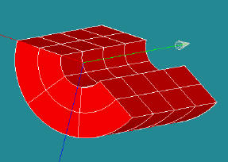

:tocdepth: 4

.. _python:

############################################
HexaBlock functionnalities: Python interface
############################################

.. _component:

Component
===========

Acces to HexaBlocks component::

  import Hexablocks

Add a new empty document in the document::

	doc = HexaBlocks.addDocument()

Add a loaded document from a "xml" file::

	doc2 = HexaBlocks.loadDocument(filename)

Get the number of opened document in the session::

	nd = HexaBlocks.countDocument()

Get the document number "i"::

	doc_i = HexaBlocks.getDocument(i)

Remove a document in the session::

	HexaBlocks.removeDocument(doc_i)

.. _document:

Document
========

Give the file associate to a document::

 	doc_file = doc.getFile()

Set the file associate to a document::

 	doc.setFile(filename)

Save a document in a file::

 	doc.saveFile()

Say if the document is saved in the file::

 	is_saved = doc.isSavedFile()

Set the tolerance need to find element::

 	doc.setTolerance(0.0001)

Get the tolerance::

 	tol = doc.getTolerance()

Set the level for messages::

	 doc.setLevel(2)

Get the level for messages::

 	level = doc.getLevel()

.. _modelmanagement:

Model management
================
Model data are exclusively composed of blocks and sub-sets composing these blocks:

- the set of hexahedra composing the model
- the set of quadrangles, edges and vertices composing these hexahedra

.. _vertex:

Vertices
---------
Add a new vertex in the document::

 	ve = doc.addVertex(x, y, z)

Get the number of vertices of the document::

 	sum_v = doc.countVertex()

Get a vertex of the document::

 	v = doc.getVertex(i)

Get the coordinates of a vertex::

 	x = ve.getX()
 	y = ve.getY()
 	z = ve.getZ()

Set the coordinates of a vertex::

 	ve.setX(x1)
 	ve.setY(y1)
 	ve.setZ(z1)

Find a vertex in the document (with a tolerance)::

 	ve = doc.findVertex(x, y, z)

.. _edge:

Edges
-----

Add an edge in the document::

 	ed = doc.addEdge(vx_1, vx_2)

Set of index: 0   1.

Get the number of edges in the document::

	 ne = doc.countEdge()

Get an edge of the document::

 	edg = doc.getEdge(i)

Get the vertices of an edge::

 	ver_a = ed.getVertex(0)
 	ver_b = ed.getVertex(1)

Find an edge in the document::

 	edg = doc.findEdge(ver1, ver2)

.. _quadrangles:

Quadrangles
-----------

Add a quadrangle in the document::

 	q1 = doc.addQuad(ed1, ed2, ed3, ed4)
 	q2 = doc.addQuadVertices(ver1, ver2, ver3, ver4)

Set of index: 0	1  2  3.

The vertices and edges follow the outline of the quadrangle.

Get the number of quadrangles of the document::

 	nq = doc.countQuad()

Get a quadrangle of the document::

 	q = doc.getQuad(i)

Get an edge of a quadrangle::

 	ed_i = q1.getEdge(0 or 1 or 2 or 3)

Get a vertex of a quadrangle::
 
	ve_j = q1.getVertex(0 or 1 or 2 or 3)
 
Find a quadrangle in the document::
 
	qua = doc.findQuad(ver1, ver2)

.. _hexahedron:

Hexahedron
----------

.. image:: _static/HEXAHEDRON.PNG
   :align: center

A: plane Z = 0

B: plane Z = 1

C: plane Y = 0

D: plane Y = 1

E: plane X = 0

F: plane X = 1

Add an hexahedron in the document::

	 h1 = doc.addHexa(q_A, q_B, q_C, q_D, q_E, q_F)

	 h=doc.addHexaVertices(ACE, ACF, ADE, ADF, BCE, BCF, BDE, DBF)

Get the number of hexahedra of the document::

	 nh = doc.countHexa()

Get an hexahedron of the document::

 	hexa = doc.getHexa(i)

Quadrangles in an hexahedron
''''''''''''''''''''''''''''''

Where are the 6 quadrangles in an hexahedron ?

Q_A or 0: plane Z=0

Q_B or 1: plane Z=1

Q_C or 2: plane Y=0

Q_D or 3: plane Y=1

Q_E or 4: plane X=0

Q_F or 5: plane X=1

Edges in an hexahedron
''''''''''''''''''''''''

Where are the 12 edges in an hexahedron ?

 E_AC or 0: planes Z=0 and Y=0

 E_AD or 1: planes Z=0 and Y=1

 E_BC or 2: planes Z=1 and Y=0

 E_BD or 3: planes Z=1 and Y=1

 E_AE or 4: planes Z=0 and X=0

 E_AF or 5: planes Z=0 and X=1

 E_BE or 6: planes Z=1 and X=0

 E_BF or 7: planes Z=1 and X=1

 E_CE or 8: planes Y=0 and X=0

 E_CF or 9: planes Y=0 and X=1

 E_DE or 10: planes Y=1 and X=0

 E_DF or 11: planes Y=1 and X=1

Vertices in an hexahedron
''''''''''''''''''''''''''''

Where are the 8 vertices in an hexahedron ?

 V_ACE or 0: planes Z=0 and Y=0 and X=0

 V_ACF or 1: planes Z=0 and Y=0 and X=1

 V_ADE or 2: planes Z=0 and Y=1 and X=0

 V_ADF or 3: planes Z=0 and Y=1 and X=1

 V_BCE or 4: planes Z=1 and Y=0 and X=0

 V_BCF or 5: planes Z=1 and Y=0 and X=1

 V_BDE or 6: planes Z=1 and Y=1 and X=0

 V_BDF or 7: planes Z=1 and Y=1 and X=1

.. _vector:

Vector
----------

Add a vector in the document::

	 vec1 = doc.addVector(dx, dy, dz)
	 vec2 = doc.addVectorVertices(ver1, ver2)

Get the values of a vector::

 	dx = vec1.getDX()
 	dy = vec1.getDY()
 	dz = vec1.getDZ()

Get the number of vector in the document::

	 nv = doc.countVector()

Get a vector of the document::

	 vk = doc.getVector(i)

.. _cylinder:

Cylinder
---------

To add a cylinder, the following data have to be mentionned:

- the coordinates of the cylinder base
- the direction of the cylinder
- height and radius of the cylinder

Add a cylinder in the document::

	 cyl = doc.addCylinder(base, direction, radius, height)

Get the values of a cylinder::

	 ver = cyl.getBase()
	 vec = cyl.getDirection()
	 r = cyl.getRadius()
	 h = cyl.getHeigth()

Access to the cylinders of the document::

 	nc = doc.countCylinder()
	cylk = doc.getCylinder(ind)

.. _pipe:

Pipe
-----
To add a pipe, the following data have to be mentionned:

- the coordinates of the pipe base
- the direction of the pipe
- height and radius of the pipe
- the inner radius
- the outer radius

Add a pipe in the document::

	 p = doc.addPipe(base, direction, int_radius, ext_radius, height)

Get the values of a pipe::

	 ver = p.getBase()
	 vec = p.getDirection()
	 int_r = p.getInternal_radius()
	 ext_r = p.getRadius()
	 h = p.getHeight()

Access to the pipes of the document::

	 np = doc.countPipe()
	 pik = doc.getPipe(index)

.. _elements:

Elements
---------

Add an empty set of elements::

	 elts = doc.addElements()

Add an element in a set of elements::

	 elts.addElement(element)

Remove an element in a set of elements::

	 elts.removeElement(element)

Remove all elements in a set of elements::

	 elts.clearElement()

Access to the elements of the document::
	
	 nel = doc.countElements()
	 elts = doc.getElements(index)

.. _removeblocks:

Remove blocks
--------------

Remove one block of the model of blocks::

	 doc.removeHexa(hexa)

Remove all blocks connected of the model of blocks::

	 doc.removeConnectedHexa(hexa)

.. image:: _static/dialogbox_remove.PNG
   :align: center

.. centered::
   legende

.. image:: _static/remove3.PNG
   :align: center

.. _cartesiangrid:

Make cartesian grids
---------------------

To add a cartesian grid to the model, the following data are required:

- the vertex of the initial hexahedron, *pt*
- the diametrically opposite vertex to the initial vertex, *vx, vy, vz*
- the number of repetition of this hexahedra along the three axes, *ni, nj, nk*

Make a Cartesian grid::

 	elts = doc.makeCartesian(pt, vx, vy, vz, ni, nj, nk)

Access to the number of elements of the grid::

 	vn = elts.countVertex()
 	en = elts.countEdge()
 	qn = elts.countQuad()
 	hn = elts.countHexa()

Access to all elements of the grid::

	 vi = elts.getVertex(i)
	 ej = elts.getEdge(j)
	 qk = elts.getQuad(k)
	 hl = elts.getHexa(l)

Specialized access to all vertices of the grid::

	 ve_xyz = elts.getVertexIJK(i, j, k)

with the range for index:

  0 <= i < ni+1

  0 <= j < nj+1

  0 <= k < nk+1

Specialized access to all edges // vx axis of the grid::

 	ed_a = elts.getEdgeI(i, j, k)

0 <= i < ni ; 

0 <= j < nj+1 ; 

0 <= k < nk+1

Specialized access to all edges // vy axis of the grid::

 	ed_b = elts.getEdgeJ(i, j, k)

0 <= i < ni+1 ;

0 <= j < nj ; 

0 <= k < nk+1

Specialized access to all edges // vz axis of the grid::

 ed_c = elts.getEdgeK(i, j, k)

0 <= i < ni+1 ; 

0 <= j < nj+1 ; 

0 <= k < nk

Specialized access to all quadrangles // on plane vx, vy::

	 qu_a = elts.getQuadIJ(i, j, k)

0 <= i < ni ; 0 <= j < nj ; 0 <= k < nk+1

Specialized access to all quadrangles // on plane vx, vz::

	 qu_b = elts.getQuadIK(i, j, k)

0 <= i < ni ; 0 <= j < nj+1 ; 0 <= k < nk

Specialized access to all quadrangles // on plane vy, vz::

	 qu_c = elts.getQuadJK(i, j, k)
 

 0 <= i < ni+1 ; 0 <= j < nj ; 0 <= k < nk

Specialized access to all hexahedra of the grid::

	 he_xyz = elts.getHexaIJK(i, j, k)

0 <= i < ni

0 <= j < nj

0 <= k < nk

.. image:: _static/cartgrid2.PNG
   :align: center

.. centered::
   Cartesian Grid

.. _cylindricalgrid:

Make cylindrical grids
-----------------------

To add a cylindrical grid, the following data are required:

- the coordinates of the cylinder base center: *pt*
- the vector defining the axe and the direction of the cylinder: *vex, vez*
- the radial, angular and axial sizes: *dr, da, dl*
- the radial, angular and axial elements number: *nr, na, nl*
- to fill or not the central part of hexahedra: *fill*

Make a cylindrical grid::

 	elts = doc.makeCylindrical(pt, vex, vez, dr, da, dl, nr, na, nl, fill)

.. centered::
   Fill of the central part of the cylinder in the case the number of angular elements is odd na = 5.

.. image:: _static/cyl_grid1.PNG
   :align: center

.. centered::
   Fill of the central part of the cylinder in the case the number of angular elements is even na = 4.

.. centered::
   Cylindrical Grid

.. _sphericalgrid:

Make spherical grids
-----------------------

To add a spherical grid, the following data are required:

- the coordinates of the central hexahedron: *pt*
- the sizes along the three axes X Y Z of  this central hexahedron : *dx, dy, dz*
- the number of embedded haxahedra: *n*

Make a spherical grid::

	 elts = doc.makeSpherical(pt, dx, dy, dz, n)

.. image:: _static/sph_grid.PNG
   :align: center

.. centered::
   Spherical Grid

.. image:: _static/sph_grid2.PNG
   :align: center

.. centered::
   Spherical Grid

.. _blockscylinderpipe:

Make blocks for a cylinder and a pipe
-------------------------------------

Make blocks for a cylinder::

	 elts = doc.makeCylinder(cyl, vb, nr, na, nl)

vb: vector on the base of the cylinder to start hexahedra.

nr: number of blocks on radial.

na: number of angular section.

nl: number of blocks along the axis of the cylinder.

Make blocks for a pipe::

	 elts = doc.makePipe(pi, vb, nr, na, nl)

.. _prismjoinquad:
 
Prism and join quadrangles
---------------------------

There are two different methods to build hexahedra from quadrangles:

- prism from quadrangles
- join two sets of quadrangles

Prism from a quadrangle or quadrangles::

 	elts = doc.prismQuad(quad, vec, nb)

	elts = doc.prismQuads([ q1, q2, q3 ], vec, nb)

Join 2 sets of quadrangles::

 	elts = doc.joinQuad(qa, qb, va1, vb1, va2, vb2, nb)
 	elts = doc.joinQuads([ qa1, qa2 ], qb, va1, vb1, va2, vb2, nb)

.. _mergeelements:
 
Merge elements
----------------

Merge 2 quadrangles::
 	
	elts = doc.mergeQuads(qa, qb, va1, vb1, va2, vb2)
 
Merge 2 edges::

	 elts = doc.mergeEdges(e1, e2, v1, v2)

Merge 2 vertices::

	 elts = doc.mergeVertices(ver1, ver2)

.. _disconnectelements:

Disconnect elements
--------------------

Disconnect a quadrangle::

 	elts = doc.disconnectQuad(hexa, qua)

Disconnect an edge::

	 elts = doc.disconnectEdge(hexa, edg)
 
Disconnect a vertex::

 	elts = doc.disconnectVertex(hexa, ver)

.. _cuthexa:

Cut hexahedra
--------------

Cut hexahedra from the model of blocks::

	 elts = doc.cut(an_edge, nb_of_cuts)

This method enables to cut in two (or more) a series of hexahedra using a series of edges propoagation.
This method is very useful to connect two connexe components of hexahedra: it enables to cut a base and to make possible the use of a "merge" to accomplish this connexion.

.. _makeelements:

Make elements by transforming elements
----------------------------------------

Rotate, translate, scale and symmetries for any kind of elements::

 	elts = doc.makeTranslation(element, vec)
 	elts = doc.makeScale(element, ver, k)
	elts = doc.makeRotation(element, ver, vec, angle)
 	elts = doc.makeSymmetryPoint(element, ver)
 	elts = doc.makeSymmetryLine(element, ver, vec)
 	elts = doc.makeSymmetryPlane(element, ver, vec)

and "element" could be Vertex, Edge, Quad, Hexa, Vector,Cylinder, Pipe and Elements and the result "elts" is always an object of type "Elements".

.. _modifyelements:

Modify elements by transforming elements
-----------------------------------------

Rotate, translate, scale and symmetries for any kind of elements::

 	doc.performTranslation(element, vec)
	doc.performScale(element, ver, k)
 	doc.performRotation(element, ver, vec, angle)
 	doc.performSymmetryPoint(element, ver)
 	doc.performSymmetryLine(element, ver, vec)
 	doc.performSymmetryPlane(element, ver, vec)

and element could be Vertex, Edge, Quad, Hexa, Vector,Cylinder, Pipe and Elements.

Associate a quadrangle of the model of blocks to the geometry
---------------------------------------------------------------

Associate to a vertex of the geometry::

 	vx.setAssociation(geom_object_vertex)

Get the association::

 	gov = vx.getAssociation()

Remove the association::

	 vx.removeAssociation()

Associate to an edge or a wire of the geometry::

	 edg.setAssociation(geom_object_1D)

Get the association::

	 go1d = edg.getAssociation()

Remove the association::

 	edg.removeAssociation()

Associate to a face or a shell of the geometry::

 	quad.setAssociation(geom_object_2D)

Give the association::

 	go2d = quad.getAssociation()

Remove the association::

	 quad.removeAssociation()

Define groups on the model of blocks
--------------------------------------

Three kinds of group of meshing elements:

- group of hexahedra::

 	HexaBlocks.HexaCell 

- group of quadrangles::

	HexaBlocks.QuadCell

- group of edges:: 

 	HexaBlocks.EdgeCell 

Four kinds of group of nodes:

- group of nodes in hexahedra::

 	HexaBlocks.HexaNode

- group of nodes in quadrangles::

 	HexaBlocks.QuadNode

- group of nodes in edges::

 	HexaBlocks.EdgeNode

- group of nodes on vertices::

 	HexaBlocks.VertexNode

Add a new group in the document::

 	hcg = doc.addGroup(name, HexaBLocks.HexaCell)
 	qcg = doc.addGroup(name, HexaBLocks.QuadCell)
 	ecg = doc.addGroup(name, HexaBLocks.EdgeCell)
 	hng = doc.addGroup(name, HexaBLocks.HexaNode)
 	qng = doc.addGroup(name, HexaBLocks.QuadNode)
 	eng = doc.addGroup(name, HexaBLocks.EdgeNode)
 	vng = doc.addGroup(name, HexaBLocks.VertexNode)

Remove a group from the document::

 	doc.removeGroup(grp)

Get the number of groups of the document::

 	ng = doc.countGroup()

Get a group of the document::

 	gr = doc.getGroup(index)

Find a group by his name in the document::

 	g = doc.findGroup(name)

Get the name of a group::

 	name = grp.getName()

Set the name of a group::

 	grp.setName(name)

Get the kind of group among the 7 possibilities::

 	kid = grp.getKind()

Add an element in a group::

	 grp.addElement(element)

Get the number of elements of a group::

	 nb = grp.countElement()

Get an element of a group::

	el = grp.getElement(index)

Remove an element of a group::

 	grp.removeElement(index)

Clear all elements of a group::

 	grp.clearElement()

.. _discretization law:

Define a law of discretization
--------------------------------

Add a new law of discretization in the document::

 	law_1 = doc.addLaw(name, nb_nodes)

Get the number of the law in the document::

 	nl = doc.countLaw()

Get a law of the document::

 	law_i = doc.getLaw(i)

Remove a law from the document::

	 doc.removeLaw(law_1)

Find a law of discretization in the document::

 	law_1 = doc.findLaw(name)

Get the name of the law::

 	name = law_1.getName()

Change the name of the law::

 	law_1.setName(name)

Get the number of nodes for the law of discretization::

	 nb = law_1.getNodes()

Set then number of nodes for the law of discretization::

	 law_1.setNodes(nb)

Get the kind of the law (uniform, arithmetic, geometric)::

 	kd = law_1.getKind()

Set the kind of law of discretization::

	 law_1.setKind(kind)

Get the coefficient of the law::

 	coef = law_1.getCoefficient()

Set the coefficient of the law::

 	law_1.setCoefficent(coef)

Get the default law. This law is applied when there is no law on a propagation::

 	default_law = doc.getLaw(0)

It is possible to change the default law::

 	default_law.setNodes(10)

And the default law is not removable

Discretization defined on the model of blocks
---------------------------------------------

Get the number of propagation existing on the model of blocks::

 	np = doc.countPropagation()

Get a propagation of the model of blocks::

 	propa = doc.getPropagation(index)

Find a propagation by an edge of the model of blocks::

	 propa = doc.findPropagation(edge)

Get all edges of the propagation and their ways in the propagation::

 	edges = propa.getEdges()
 	bools = propa.getWays()

Set a law of discretization for a propagation::

	 propa.setLaw(law)

Get the law of the propagation for a propagation::

 	law = propa.getLaw()

Set the way where the law is applied on the propagation::

 	propa.setWays(va, vb)

va, vb are vertices of an edge of the propagation and the way to apply the law is from "va" to "vb".

Generate the mesh
---------------------

Use the SMESH component of SALOME::

 	import smesh
	m = smesh.HexaBlocks(doc)

Export to a MED file::

 	m.ExportMED(/tmp/mesh.med)

Get some informations about the mesh::

 	print "Number of hexahedra: ", m.NbHexas()
 	print "Number of quadrangles: ", m.NbQuadrangles()
 	print "Number of segments: ", m.NbEdges()
 	print "Number of nodes: ", m.NbNodes()

