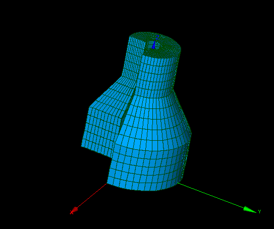

:tocdepth: 3

.. _tuiassoquadtogeom:

=============================================
Associate the model of blocks to the geometry
=============================================

.. _tuiassoelemts:

Elements association
====================

Associate to a vertex of the geometry::

    vx.setAssociation(geom_object_vertex)

Get the association::

    gov = vx.getAssociation()

Associate to an edge or a wire of the geometry::

    l = edg.addAssociation(geom_object_1D, debut, val)

Get the associations::

    edge_associations = edg.getAssociations()

Associate to a face or a shell of the geometry::

    l = quad.addAssociation(geom_object_2D)

Give the association::

    go2d = quad.getAssociations()

.. _tuiassolines:

Associate by lines
==================

To associate an opened line to the geometry, the following data have
to be mentioned:

- the starting edge of the model of blocks: *mstart*
- the list of edges of the model of blocks: *mline*
- the starting edge of the geometry: *gstart*
- the curvilinear abscissa on the starting edge of the geometry: *pstart* (double)
- the list of edges of the geometry: *gline*
- the curvilinear abscissa on the last edge of the geometry: *pend*

The number of edges of the model of blocks to associate may be
different from the number of edges of the geometry. 

Associate an opened line::

        l = doc.associateOpenedLine(mstart, mline, gstart, pstart, gline, pend) 

To associate a closed line to the geometry, the following data have
to be mentioned:

- the starting vertex of the model of blocks: *mfirst*
- the starting edge of the model of blocks: *mstart*
- the list of edges of the model of blocks: *mline*
- the starting edge of the geometry: *gstart*
- the curvilinear abscissa on the starting edge of the geometry: *pstart* (double)
- the list of edges of the geometry: *gline*

The number of edges of the model of blocks to associate may be
different from the number of edges of the geometry. 

Associate a closed line::

    l = doc.associateClosedLine(mfirst, mstart, mline, gstart, pstart, gline)

.. _tuiassocfacenote:

Note for face association
=========================

Face association (implicite or explicite) is not necessary for:

- planar faces, 
- cylindrical faces,
- conical faces.

Only edges association (implicite) on segments or arcs of cirle is necessary.

The following example show a model of block on which there isn't faces association but only 
implicite edges association on arcs of circle.
 
 
Example
-------

.. literalinclude:: test_doc/test_cone/test_cone.py
   :linenos:

Result
------

.. centered::
   Cone mesh
   
   
GUI command: :ref:`guiassoquadtogeom`
