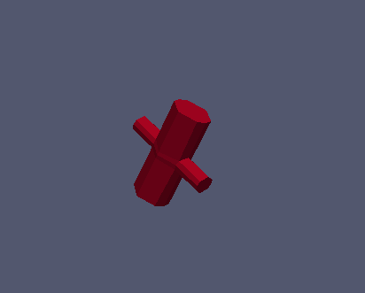
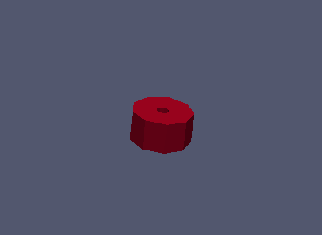
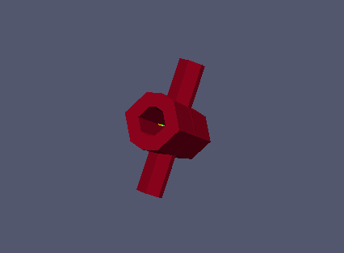

:tocdepth: 3

.. _tuiblockscylinderpipe:

=====================================
Make blocks for a cylinder and a pipe
=====================================

.. _tuimakecylinder:

Make blocks for a cylinder
==========================

.. code-block:: python

	elts = doc.makeCylinder(cyl, vb, nr, na, nl)

cyl: cylinder built using *addCylinder()* function (:ref:`tuicylinder`)

vb: vector on the base of the cylinder to start hexahedra.

nr: number of blocks on radial.

na: number of angular section.

nl: number of blocks along the axis of the cylinder.

Operations on *elts*: :ref:`tuielements2`

The result is an array of hexahedra ranked first by following the
radial direction and the angular direction, then according to the
layers in the cylinder axis.

Example of cylinder construction
--------------------------------

.. literalinclude:: test_doc/cylinder_pipe/make_cylinder.py
   :linenos:

.. image:: _static/make_cylinder.png
   :align: center

.. centered::
   Cylinder

.. _tuimakecylinders:

Make blocks for cylinders
=========================

.. code-block:: python

	elts = doc.makeCylinders (cylinder1, cylinder2)
	
Operations on *elts*: :ref:`tuielements2`

Construction of an element from 2 cylinders:

.. literalinclude:: test_doc/cylinder_pipe/make_cylinders.py
   :linenos:

.. centered::
   Element from 2 cylinders
   
The result is an array of hexahedral.

.. _tuimakepipe:

Make blocks for a pipe
======================

.. code-block:: python

    elts = doc.makePipe(pi, vb, nr, na, nl)

pi: pipe built using *addPipe()* function (:ref:`tuipipe`)

vb: vector on the base of the pipe to start hexahedra.

nr: number of blocks on radial.

na: number of angular section.

nl: number of blocks along the axis of the pipe.

Operations on *elts*: :ref:`tuielements2`

The result is an array of hexahedral arranged in layers following the
first radial and angular layers, and finally the axial layers.

Example of pipe construction
----------------------------

.. literalinclude:: test_doc/cylinder_pipe/make_pipe.py
   :linenos:

.. centered::
   Pipe

.. _tuimakepipes:

Make blocks for pipes
=====================

.. code-block:: python

	elts  = doc.makePipes (pipe1, pipe2)

Operations on *elts*: :ref:`tuielements2`

Construction of an element from 2 pipes:

.. literalinclude:: test_doc/cylinder_pipe/make_pipes.py
   :linenos:

.. centered::
   Element from 2 pipes

The result is an array of hexahedra where we first find hexahedra of
the first pipe and the second pipe. Each pipe range hexahedra following
first radial layers and angular layers, and finally the axial layers.

Operations on *elts*: :ref:`tuielements2`

GUI command: :ref:`guiblockscylinderpipe`
