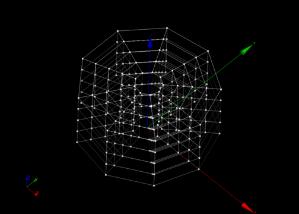

:tocdepth: 3

.. _tuiblockscylinderpipe:

=====================================
Make blocks for a cylinder and a pipe
=====================================

Make blocks for a cylinder
==========================

::

	 elts = doc.makeCylinder(cyl, vb, nr, na, nl)

cyl: cylinder

vb: vector on the base of the cylinder to start hexahedra.

nr: number of blocks on radial.

na: number of angular section.

nl: number of blocks along the axis of the cylinder.

The result is an array of hexahedral ranked first by following the
radial direction and the angular direction, then according to the
layers in the cylinder axis.

Example
-------

::

        import hexablock
        doc = hexablock.addDocument()

        base = doc.addVertex(0, 0, 0)
        direction = doc.addVector(0, 0, 1)
        radius = 4
        height = 5

        cyl = doc.addCylinder(base, direction, radius, height)

        vb = doc.addVector(1, 0, 0)
        nr = radius
        na = 9  
        nl = height
        elts = doc.makeCylinder(cyl, vb, nr, na, nl)

.. centered::
   Cylinder

Make blocks for cylinders
=========================

::

	 elts = doc.makeCylinders(cyl1, cyl2)

The result is an array of hexahedral.

Make blocks for a pipe
======================

::

	 elts = doc.makePipe(pi, vb, nr, na, nl)

The result is an array of hexahedral arranged in layers following the
first radial and angular layers, and finally the axial layers.

Example
-------

::

        import hexablock
        doc = hexablock.addDocument()

        orig = doc.addVertex(50, 0, 0)
        vz = doc.addVector(0, 0, 1)
        int_radius = 3
        ext_radius = 4
        height = 5
        pi = doc.addPipe(orig, vz, int_radius, ext_radius, height)

        vb = doc.addVector(1, 0, 0)
        nr = 4
        na = 9
        nl = 5
        elts = doc.makePipe(pi, vb, nr, na, nl)

.. image:: _static/pipe.png
   :align: center

.. centered::
   Pipe

Make blocks for pipes
=====================

::

	 elts = doc.makePipes(p1, p2)

The result is an array of hexahedral where we first find hexahedral of
the first pipe and the second pipe. Each pipe range hexaedra following
first radial layers and angular layers, and finally the axial layers.

GUI command: :ref:`guiblockscylinderpipe`
