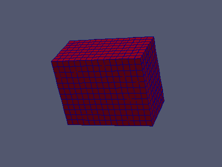

:tocdepth: 3

.. _tuicartgrid:

====================
Make cartesian grids
====================

To add a cartesian grid to the model, the following data are required:

- the vertex of the initial hexahedron: *pt*
- the vector corresponding to the diametrically opposite vertex to the initial vertex: *vx, vy, vz*
- the number of repetition of this hexahedra along the three axes: *ni, nj, nk*

Make a Cartesian grid::

    elts = doc.makeCartesian(pt, vx, vy, vz, ni, nj, nk)

or:
	- the vertex of the initial hexahedron: *pt*
	- the vector corresponding to the diametrically opposite vertex to the initial vertex
	- the coordinates of the vector *vec1* on x, y and z: *px, py, pz*
	- the number of repetition of this hexahedra along the three axes: *mx, my, mz*

.. code-block:: python

    elts = doc.makeCartesian1(pt, vec1, px, py, pz, mx, my, mz)

Operations on *elts*: :ref:`tuielements2`

Example
-------

.. literalinclude:: test_doc/grid/cartesian_grid.py
   :linenos:

.. centered::
   Cartesian Grid

GUI command: :ref:`guicartgrid`
