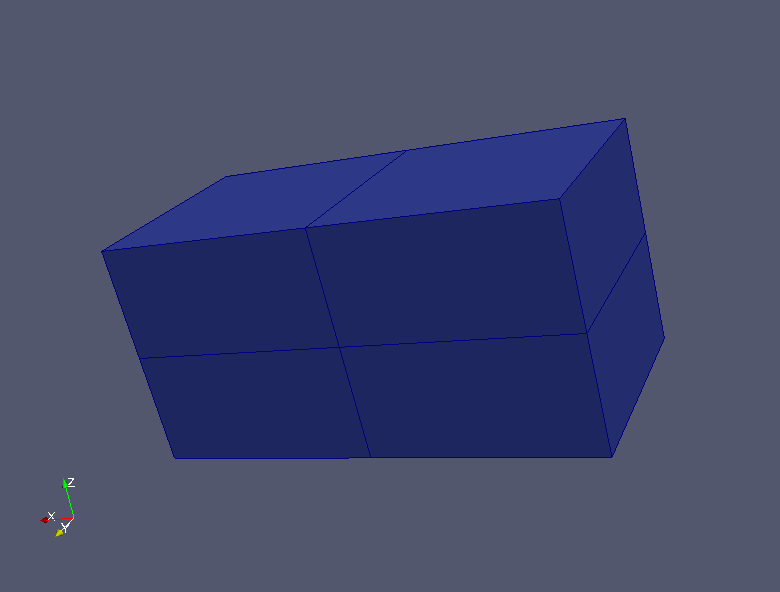

:tocdepth: 3

.. _tuicuthexa:

=============
Cut hexahedra
=============

Cut hexahedra from the model of blocks::

	 elts = doc.cut(an_edge, nb_of_cuts)

This method enables to cut in two (or more) a series of hexahedra using a series of edges propagation.
This method is very useful to connect two connexe components of hexahedra: it enables to cut a base and to make possible the use of a "merge" to accomplish this connexion.

Example
-------

::

    import hexablock 
    doc = hexablock.addDocument()

    size_x = 2
    size_y = 1
    size_z = 1

    orig = doc.addVertex(0, 0, 0)
    dirVr = doc.addVector(1, 1, 1)

    grid = doc.makeCartesian1(orig, dirVr, size_x, size_y, size_z, 0, 0, 0) 
    arete = grid.getEdgeK(0, 0, 0)

    doc.cut(arete, 1)
               

.. centered::
   no cut

.. centered::
   cut

GUI command: :ref:`guicuthexa`
