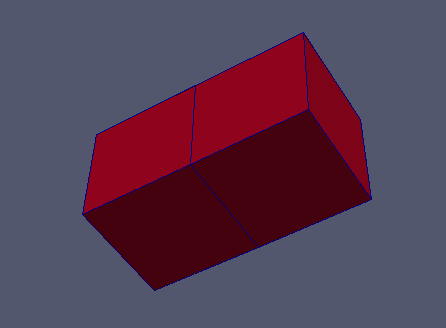
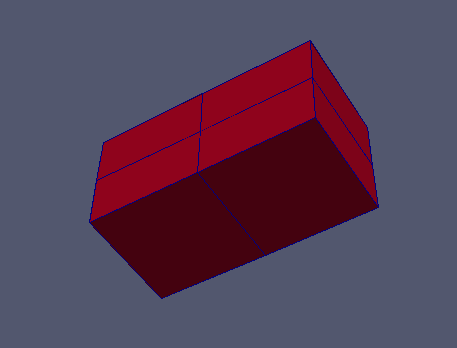

:tocdepth: 3

.. _tuicuthexa:

=============
Cut hexahedra
=============

Cut hexahedra from the model of blocks::

    elts = doc.cut(an_edge, nb_of_cuts)

Operations on *elts*: :ref:`tuielements2`

This method enables to cut in two (or more) a series of hexahedra using a series of edges propagation.

Example
-------

.. literalinclude:: test_doc/cut_hexa/cut_hexa.py
   :linenos:

.. centered::
   Initial hexa
   
   

.. centered::
   Cut hexa
   

GUI command: :ref:`guicuthexa`
