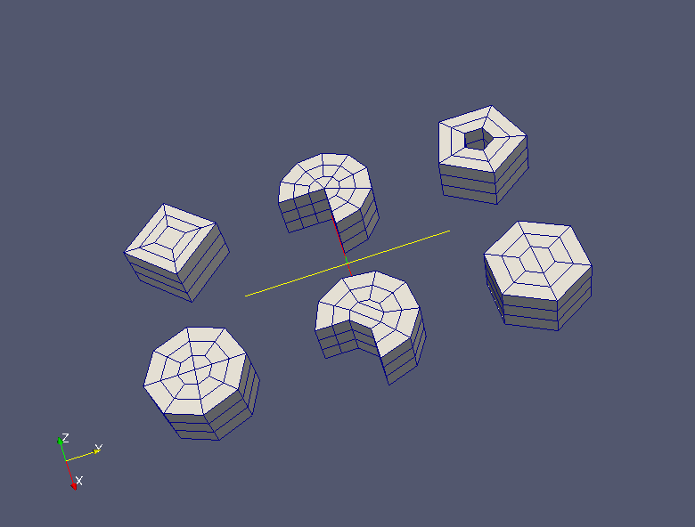

:tocdepth: 3

.. _tuicylgrid:

======================
Make cylindrical grids
======================

To add a cylindrical grid, the following data are required:

- the coordinates (vertex) of the cylinder base center: *pt*
- the vectors defining the axis and the direction of the cylinder: *vex, vez*
- the radial, angular and axial sizes: *dr, da, dl*
- the radial, angular and axial elements number: *nr, na, nl*
- to fill or not the central part of hexahedra: *fill*

Make a cylindrical grid::

    elts = doc.makeCylindrical(pt, vex, vez, dr, da, dl, nr, na, nl, fill)

The result is an array of hexahedra which are arranged along the
radial axis first, then the angular axis, then according to the layers
and then possibly hexahedra filling the central part.

The filling the central part of the cylinder is made ​accordingly to the two following cases:

.. image:: _static/cyl_grid2.PNG
   :align: center

.. centered::
   Filling of the central part of the cylinder in the case the number of angular elements is odd na = 5.

.. image:: _static/cyl_grid1.PNG
   :align: center

.. centered::
   Filling of the central part of the cylinder in the case the number of angular elements is even na = 4.

Example
-------

Filling rule is illustrated by different case-tests::

        import hexablock
        doc = hexablock.addDocument()

        orig1 = doc.addVertex(0, 0, 0)
        orig2 = doc.addVertex(10, 0, 0)
        orig3 = doc.addVertex(0, 10, 0)
        orig4 = doc.addVertex(10, 10, 0)
        orig5 = doc.addVertex(0, 20, 0)
        orig6 = doc.addVertex(10, 20, 0)

        vz = doc.addVector(0, 0, 1)
        vx = doc.addVector(1, 0, 0)

        dr = 1
        dl = 1
        nr = 2
        nl = 3

        c1 = doc.makeCylindrical(orig1, vx, vz, dr, 360, dl, nr, 4, nl, True)
        c2 = doc.makeCylindrical(orig2, vx, vz, dr, 360, dl, nr, 8, nl, True)
        c3 = doc.makeCylindrical(orig3, vx, vz, dr, 270, dl, nr, 8, nl, True)
        c4 = doc.makeCylindrical(orig4, vx, vz, dr, 270, dl, nr, 7, nl, True)
        c5 = doc.makeCylindrical(orig5, vx, vz, dr, 360, dl, nr, 5, nl, True)
        c6 = doc.makeCylindrical(orig6, vx, vz, dr, 360, dl, nr, 6, nl, True)

.. centered::
   Cylindrical Grids

GUI command: :ref:`guicylgrid`
