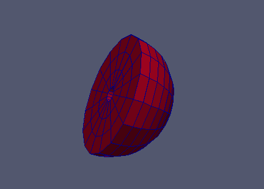
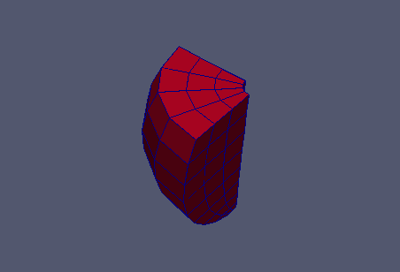
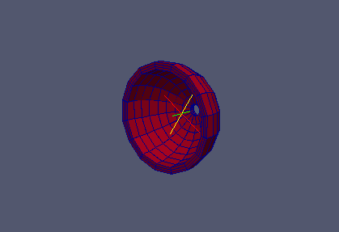
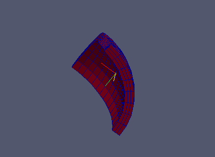

:tocdepth: 3

.. _tuihemisphere:

=======================
Hemisphere Construction
=======================

.. _tuihemisphericalgrid:

Hemispherical Grid
==================

To create an hemispherical grid in textual mode, you need the following arguments:
     
- center : center coordinates of the sphere
- vx     : normal vector to the surface of the cross section
- vz     : axes of the hole
- radius : radius size of the sphere
- radhole: radius size of the hole
- orig   : coordinates of a point on the surface of the cross section
- nrad   : number of hexahedra from the center of the sphere
- nang   : number of hexahedra along the perimeter of the sphere
- nhaut  : number of hexahedra on the height of the sphere

::

	elts = doc.makeSphere (center, vx, vz, radius, radhole, orig, nrad, nang, nhaut)
	
Operations on *elts*: :ref:`tuielements2`

    
Code Sample
-----------

.. literalinclude:: test_doc/hemispherical_rind/hemispherical_grid.py
   :emphasize-lines: 22
   :linenos:

Result
------

.. _tuiparthemisphericalgrid:

Partial Hemispherical Grid
==========================

To create a partial hemispherical grid in textual mode, you need the following parameters:

- center : center coordinates of the sphere
- vx     : normal vector to the surface of the cross section
- vz     : axes of the hole
- radius : radius size of the sphere
- radhole: radius size of the hole
- orig   : coordinates of a point on the surface of the cross section
- angle  : fill this field to customize the section (value in degree)
- nrad   : number of hexahedra from the center of the sphere
- nang   : number of hexahedra along the perimeter of the sphere
- nhaut  : number of hexahedra on the height of the sphere

::

	elts = doc.makePartSphere (center, vx, vz, radius, radhole, orig, angle, nrad, nang, nhaut)

Operations on *elts*: :ref:`tuielements2`

	
Code Sample
-----------

.. literalinclude:: test_doc/hemispherical_rind/partial_hemispherical_grid.py
   :emphasize-lines: 23,24
   :linenos:

Result
------

.. _tuirindgrid:

Rind Grid
=========

To create a rind grid in textual mode, you need the following arguments:

- center : center coordinates of the sphere
- vx     : normal vector to the surface of the cross section
- vz     : axes of the hole
- radius : radius size of the sphere
- internal radius: fill this field to create rind
- radhole: radius size of the hole
- orig   : coordinates of a point on the surface of the cross section
- nrad   : number of hexahedra from the center of the sphere
- nang   : number of hexahedra along the perimeter of the sphere
- nhaut  : number of hexahedra on the height of the sphere

::

	elts = doc.makeRind (center, vx, vz, radius, radint, radhole, orig, nrad, nang, nhaut)
    
Operations on *elts*: :ref:`tuielements2`

              
Code Sample
-----------

.. literalinclude:: test_doc/hemispherical_rind/rind_grid.py
   :emphasize-lines: 23,24
   :linenos:

Result
------

.. _tuipartrindgrid:

Partial Rind Grid
=================

To create a partial rind grid in textual mode, you need the following arguments:

- center : center coordinates of the sphere
- vx     : normal vector to the surface of the cross section
- vz     : axes of the hole
- radius : radius size of the sphere
- radint : fill this field to create rind
- radhole: radius size of the hole
- orig   : coordinates of a point on the surface of the cross section
- angle  : fill this field to customize the section (value in degree)
- nrad   : number of hexahedra from the center of the sphere
- nang   : number of hexahedra along the perimeter of the sphere
- nhaut  : number of hexahedra on the height of the sphere

::

	elts = doc.makePartRind (center, vx, vz, radius, radint, radhole, orig, angle, nrad, nang, nhaut)

Operations on *elts*: :ref:`tuielements2`

                      
Code Sample
-----------

.. literalinclude:: test_doc/hemispherical_rind/partial_rind_grid.py
   :emphasize-lines: 24,25
   :linenos:

Result
------

GUI command: :ref:`guihemisphere`
