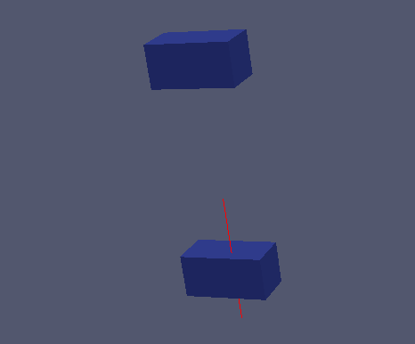
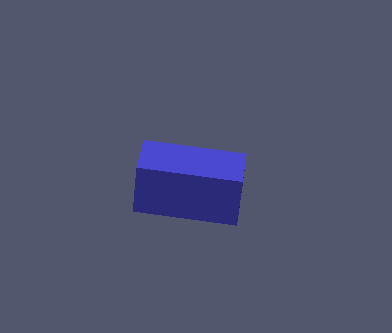
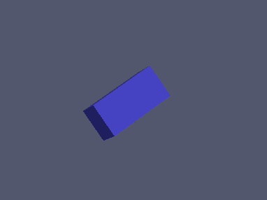
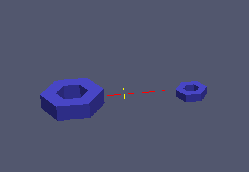

:tocdepth: 3

.. _tuimakeelements:

======================================
Make elements by transforming elements
======================================

Rotate and translate for any kind of elements::

    elts = doc.makeTranslation(elements, vec)
    elts = doc.makeRotation(elements, ver, vec, angle)
    elts = doc.makeScale (elements, destination_point, k)

and "element" could be Vertex, Edge, Quadrangle, Hexahedeon, Vector, Cylinder,
Pipe and Elements and the result "elts" is always an object of type
"Elements".

Operations on *elts*: :ref:`tuielements2`

Example
=======

Translation
-----------

.. literalinclude:: test_doc/make_transformation/make_translation.py
   :linenos:

.. centered::
   Translation

Rotation
--------

.. literalinclude:: test_doc/make_transformation/make_rotation.py
   :linenos:

.. centered::
   Initial

.. centered::
   Rotation
   
Scale
-----

.. literalinclude:: test_doc/make_transformation/make_scale.py
   :linenos:

.. centered::
   Scaling
   
   
GUI command: :ref:`guimakeelements`
