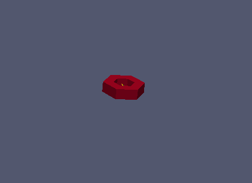
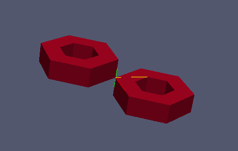
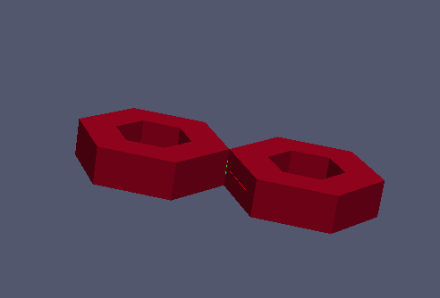
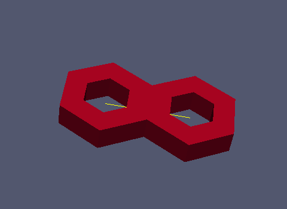

:tocdepth: 3

.. _tuimakesymmetry:

============= 
Make Symmetry
=============

There are three differents ways to make the symmetry of an element:

- Symmetry by point
- Symmetry by line
- Symmetry by plane

.. _guimakesympoint:

Symmetry by point
=================

To make the symmetry of an element by point, you need to define:

- the element
- the symmetry center

::

	elts = doc.makeSymmetryPoint (grid, orig)
	 
Operations on *elts*: :ref:`tuielements2`

Here is an example where we make the symmetry of a grid:

Example
-------

.. literalinclude:: test_doc/make_symmetry/make_sym_point.py
   :emphasize-lines: 32
   :linenos:

Result
------

.. centered::
   Initial

.. centered::
   Symmetry of a grid by point

.. _guimakesymline:

Symmetry by line
================

To make the symmetry of an element by line, you need to define:

- the element
- a point and a direction to define the line of symmetry

::

	elts = doc.makeSymmetryLine (grid, orig, dir)
	 
Operations on *elts*: :ref:`tuielements2`

Example
-------

Code
----

.. literalinclude:: test_doc/make_symmetry/make_sym_line.py
   :emphasize-lines: 33
   :linenos:

Result
------

.. centered::
   Symmetry of a grid by line

.. _guimakeplane:

Symmetry by plane
=================

To make the symmetry of an element by plane, you need to define:

- the element
- a point and a direction to define the plane of symmetry

::

	elts = doc.makeSymmetryPlane (grid, orig, dir)
	 
Operations on *elts*: :ref:`tuielements2`

Example
-------

Code
----

.. literalinclude:: test_doc/make_symmetry/make_sym_plane.py
   :emphasize-lines: 33
   :linenos:

Result
------

.. centered::
   Symmetry of a grid by plane

   
GUI command: :ref:`guimakesymmetry`
