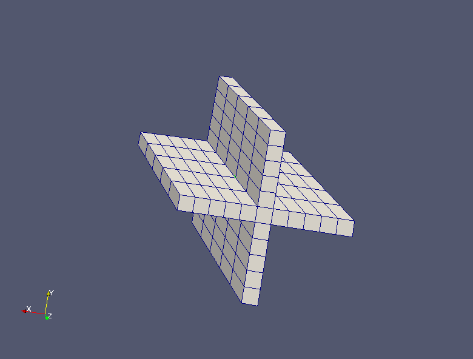
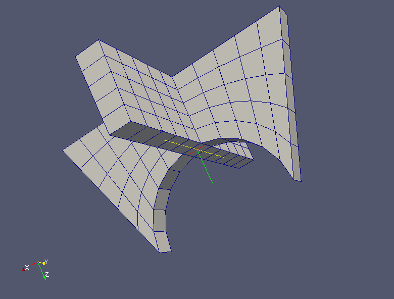

:tocdepth: 3

.. _tuiprismjoinquad:

========================== 
Prism and join quadrangles
==========================

There are two different methods to build hexahedra from quadrangles:

- prism from quadrangles
- join two sets of quadrangles

Prism from a quadrangle or quadrangles
======================================

::

    elts = doc.prismQuad(quad, vec, nb)

    elts = doc.prismQuads([ q1, q2, q3 ], vec, nb)

From a list of quadrangles, a set of hexahedra is created. Given the
arbitrary nature of the start list, we can not provide additional
information on the order of the intermediate elements (vertices,
edges, quads) that contains the container-like Elements.

Example
-------

::

 import hexablock
 doc = hexablock.addDocument()

 orig = doc.addVertex(0, 0, 0)
 dx = doc.addVector(1, 0, 0)
 dy = doc.addVector(0, 1, 0)
 dz = doc.addVector(0, 0, 1)

 dimx = 11
 dimy = 11
 dimz = 2
 grid = doc.makeCartesian(orig, dx, dy, dz, dimx, dimy, dimz)

 mx = dimx/2
 my = dimy/2
 prems = grid.getQuadIJ(mx, my, dimz)

 liste = [prems]
 liste.extend([grid.getQuadIJ(nx, my, dimz) for nx in range(dimx) if nx != mx])
 liste.extend([grid.getQuadIJ(mx, ny, dimz) for ny in range(dimy) if ny != my])

 vec = doc.addVector(1, 1, 1)
 elts = doc.prismQuads(liste, vec, 5) 

.. centered::
   Prism Quads

Join 2 sets of quadrangles
==========================

::

    elts = doc.joinQuad(qa, qb, va1, vb1, va2, vb2, nb)

    elts = doc.joinQuads([ qa1, qa2 ], qb, va1, vb1, va2, vb2, nb)

Example
-------

::

 import hexablock
 doc = hexablock.addDocument()

 orig1 = doc.addVertex(0, 0, 0)
 dx = doc.addVector(1, 0, 0)
 dy = doc.addVector(0, 1, 0)
 dz = doc.addVector(0, 0, 1)

 dimx = 11
 dimy = 11
 dimz = 2
 grid1 = doc.makeCartesian(orig1, dx, dy, dz, dimx, dimy, dimz)

 orig2 = doc.addVertex(dimx/2.0, 0, 8)
 grid2 = doc.makeCylindrical(orig2, dx, dy, 1, 180, 1, dimz, dimy,
                             dimx, False)

 mx = dimx/2
 my = dimy/2
 prems = grid1.getQuadIJ(mx, my, dimz)
 cible = grid2.getQuadJK(dimz, mx, my)

 v1 = prems.getVertex(0)
 v3 = prems.getVertex(1)
 v2 = cible.getVertex(1)
 v4 = cible.getVertex(2)

 liste = [prems]
 liste.extend([grid1.getQuadIJ(nx, my, dimz) for nx in range(dimx) if nx != mx])
 liste.extend([grid1.getQuadIJ(mx, ny, dimz) for ny in range(dimy) if ny != my])

 height = 5

 elts = doc.joinQuads(liste, cible, v1, v2, v3, v4, height) 

.. centered::
   Join Quads

GUI command: :ref:`guiprismjoinquad`
