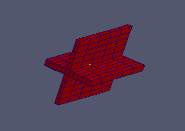
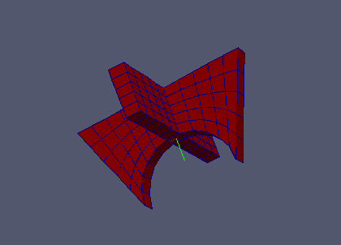

:tocdepth: 3

.. _tuiprismjoinquad:

========================== 
Prism and join quadrangles
==========================

There are two different methods to build hexahedra from quadrangles:

- prism from quadrangles
- join two sets of quadrangles

.. _tuiprismquad:

Prism from a quadrangle or quadrangles
======================================

Make a regular prism::

    elts = doc.prismQuad(quad, vec, nb)

    elts = doc.prismQuads(quads_list, vec, nb)
    
    
Make an irregular prism::

	elts = doc.prismQuadsVec (quads_list, axis, heights, opt)

Operations on *elts*: :ref:`tuielements2`

From a list of quadrangles, a set of hexahedra is created. Given the
arbitrary nature of the start list, we can not provide additional
information on the order of the intermediate elements (vertices,
edges, quads) that contains the container-like Elements.

Example (regular mode)
----------------------

.. literalinclude:: test_doc/prism_quad_join/prism_quads.py
   :linenos:

.. centered::
   Regular Prism Quads

Example (regular mode)
----------------------

.. literalinclude:: test_doc/prism_quad_join/prism_quads_vec.py
   :linenos:

.. centered::
   Irregular Prism Quads

.. _tuijoinquad:

Join 2 sets of quadrangles
==========================

::

    elts = doc.joinQuad(qa, qb, va1, vb1, va2, vb2, nb)

    elts = doc.joinQuads([ qa1, qa2 ], qb, va1, vb1, va2, vb2, nb)

Operations on *elts*: :ref:`tuielements2`

Example
-------

.. literalinclude:: test_doc/prism_quad_join/join_quads.py
   :linenos:

.. centered::
   Join Quads

GUI command: :ref:`guiprismjoinquad`
