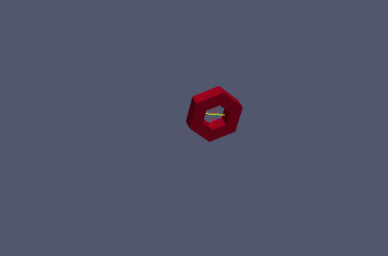
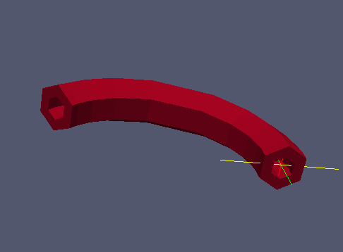

:tocdepth: 3

.. _tuiquadrevolution:

=============== 
Quad Revolution
===============

To make quad revolution you need:

- a set of quadrangles you want to make a revolution on

.. literalinclude:: test_doc/quad_revolution/make_grid.py
   :lines: 3-
   :linenos:

- center of rotation::

	center = doc.addVertex (0, -10, 0)
 
- axis of rotation (a vector)::

	axis   = doc.addVector (1, 0, 0)
 
- Specify the rotation’s angle at each step (a list of angles in degrees)::

	angles = [5, 10, 15, 20, 30, 20, 15, 10, 5 ]

Then you can make you can make your quad revolution this way::

	elts = doc.revolutionQuads  (liste, center, axis, angles)

Operations on *elts*: :ref:`tuielements2`

Complete Example
================

Snippet Code
------------

.. literalinclude:: test_doc/quad_revolution/revolution.py
   :emphasize-lines: 59
   :linenos:

The result
----------

.. centered::
   Initial

.. centered::
   Quad Revolution

   
GUI command: :ref:`guiquadrevolution`

