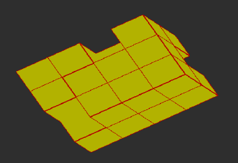

:tocdepth: 3

.. _tuiremove:

================
Remove hexahedra
================

Remove one hexahedra of the model of blocks::

    doc.removeHexa(hexa)

Remove all hexahedra connected of the model of blocks::

    doc.removeConnectedHexa(hexa)

GUI command: :ref:`guiremove`

