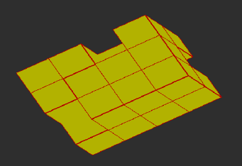

:tocdepth: 3

.. _tuiremove:

===============
Remove hexaedra
===============

Remove one hexaedra of the model of blocks::

	 doc.removeHexa(hexa)

Remove all hexaedra connected of the model of blocks::

	 doc.removeConnectedHexa(hexa)

GUI command: :ref:`guiremove`

