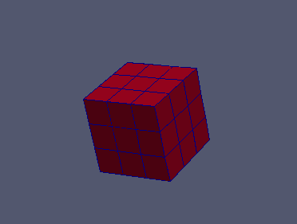
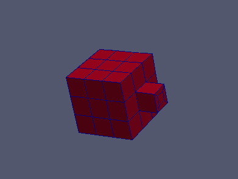

:tocdepth: 3

.. _tuireplacehexa:

==================
Replace Hexahedron
==================

The following example explain how to replace hexa in script mode.
For parameters description see the gui documentation of replace hexa.

::

	elts = doc.replace (qpattern, pd2,c1, pa2,c2, pb2,c3)
	
Operations on *elts*: :ref:`tuielements2`

Complete example
----------------

.. literalinclude:: test_doc/replace_hexa/replace_hexa.py
   :linenos:

Result
------

.. centered::
   Before hexa replacement

   

.. centered::
   After hexa replacement
   
GUI command: :ref:`guireplacehexa`